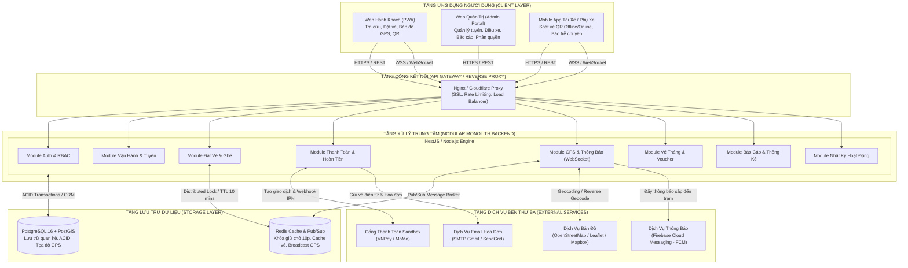
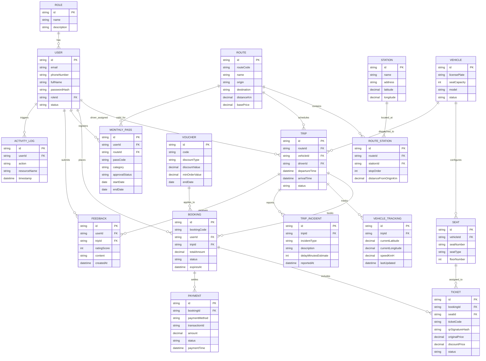

# KẾ HOẠCH KỸ THUẬT TỔNG THỂ (TECHNICAL PLAN)
## DỰ ÁN: HỆ THỐNG VÉ XE BUÝT THÔNG MINH (SMART BUS TICKETING SYSTEM - ICTU)

---

## 1. Tóm tắt kiến trúc tổng thể

### 1.1. Mô hình kiến trúc đề xuất: Modular Monolith (Monolithic phân tầng theo Module)
Với quy mô đội ngũ thực tập gồm **3 Backend + 3 Frontend + 3 Tester**, thời gian thực hiện ngắn hạn (**5 tuần / 5 Sprint**) và mục tiêu xây dựng hệ thống chạy ổn định cho 3 đầu mối tương tác (Hành khách, Tài xế, Quản trị viên), việc lựa chọn kiến trúc **Modular Monolith** kết hợp với mô hình **Phân tầng (Layered Architecture - Controller / Service / Repository)** là phương án tối ưu nhất vì các lý do:
- **Tập trung hóa triển khai (Deployment Simplicity):** Toàn bộ Backend chạy trong một instance dịch vụ duy nhất, chia sẻ chung một Database quan hệ, loại bỏ hoàn toàn chi phí thiết lập hạ tầng phân tán, service mesh, network latency và distributed tracing phức tạp của Microservices.
- **Tách biệt ranh giới rõ ràng (High Cohesion, Loose Coupling):** Mã nguồn Backend được phân tách thành các module nghiệp vụ độc lập (`auth`, `routes`, `trips`, `booking`, `payment`, `tracking`, `analytics`). Ba lập trình viên Backend có thể phụ trách các module riêng biệt mà không gây xung đột mã nguồn (merge conflict).
- **Phục vụ đa kênh giao diện đồng nhất:** Một hệ thống RESTful API chuẩn hóa kết hợp WebSocket Gateway phục vụ đồng thời cho 3 ứng dụng máy khách (Client):
  1. *Passenger Web/PWA*: Dành cho hành khách tra cứu, đặt vé, thanh toán, xem vị trí xe.
  2. *Admin/Manager Web Portal*: Dành cho điều hành, quản lý tuyến/lịch trình, duyệt ưu đãi, thống kê.
  3. *Driver/Conductor Mobile App*: Ứng dụng di động nhẹ cho tài xế/phụ xe thực hiện soát vé và báo sự cố.

### 1.2. Sơ đồ kiến trúc hệ thống (System Architecture Diagram)



---

## 2. Đề xuất Tech Stack (Công nghệ & Lý do lựa chọn)

| Thành phần | Công nghệ đề xuất | Lý do kỹ thuật & Tính khả thi cho đồ án 5 tuần |
| :--- | :--- | :--- |
| **Frontend Web** *(Hành khách + Admin)* | **React.js (Vite) + TypeScript + Ant Design + Tailwind CSS** | - **Vite:** Tốc độ build siêu nhanh, dung lượng nhẹ.<br/>- **Ant Design:** Cung cấp sẵn hệ thống component quản trị biểu mẫu, bảng dữ liệu, lọc, modal cực mạnh cho Admin Portal.<br/>- **Tailwind CSS:** Linh hoạt tùy biến giao diện hiện đại, thân thiện cho trang Hành khách.<br/>- **Zustand:** Quản lý state gọn nhẹ, dễ tiếp cận hơn Redux Toolkit.<br/>- **Leaflet & OpenStreetMap:** Hiển thị bản đồ trạm, lộ trình tuyến và xe bus chạy thời gian thực hoàn toàn miễn phí, không yêu cầu thẻ tín dụng quốc tế như Google Maps API.<br/>- **SVG / Canvas:** Render sơ đồ ghế xe trực quan, đổi màu theo trạng thái ghế (trống, đang giữ chỗ, đã bán). |
| **Mobile App** *(Tài xế/Phụ xe)* | **React Native (Expo)** hoặc **PWA với Camera Web API** | - Tận dụng tối đa kỹ năng JavaScript/TypeScript của đội Frontend, không tốn thời gian học thêm ngôn ngữ mới (Flutter/Dart hay Kotlin).<br/>- **Expo:** Tích hợp sẵn module quét camera (`expo-barcode-scanner` hoặc `expo-camera`) để soát mã QR cực nhanh.<br/>- **Offline Engine:** Sử dụng `WatermelonDB` hoặc `AsyncStorage` để lưu trước danh sách vé (Manifest) của chuyến xe, hỗ trợ xác thực mã vé offline khi xe đi vào vùng sóng yếu/mất sóng. |
| **Backend Framework** | **Node.js (NestJS) + TypeScript** | - **Cấu trúc Module chuẩn hóa:** Kiến trúc Dependency Injection chặt chẽ giúp 3 Backend Developer chia việc theo folder (`modules/*`) mà không bị conflict.<br/>- **Type Safety:** Đồng bộ kiểu dữ liệu end-to-end với Frontend thông qua TypeScript DTO.<br/>- **Validation & Docs:** Tự động tạo Swagger API Documentation (`@nestjs/swagger`) và validate dữ liệu vào bằng `class-validator`. |
| **Cơ sở dữ liệu chính** | **PostgreSQL 16 + PostGIS Extension** | - Đảm bảo tính toàn vẹn dữ liệu giao dịch vé, tiền bạc nhờ chuẩn **ACID** mạnh mẽ.<br/>- Extension **PostGIS** hỗ trợ tính toán khoảng cách địa lý (tọa độ GPS xe với tọa độ trạm dừng) để kích hoạt thông báo xe sắp đến trạm nhanh chóng. |
| **Bộ nhớ đệm & Realtime Broker** | **Redis (Upstash / Local Redis)** | - Quản lý **Khóa giữ chỗ tạm thời (Seat Lock)** trong 10 phút sử dụng cơ chế Redis Key Expiration (TTL).<br/>- Đóng vai trò Message Broker (Pub/Sub) cho tọa độ GPS của xe buýt giữa Driver App và Passenger Web. |
| **Giao thức Realtime** | **WebSocket (Socket.io)** | - Độ trễ cực thấp (< 100ms) cho việc truyền tọa độ GPS từ tài xế lên hệ thống và broadcast xuống hành khách đang chờ xe.<br/>- Tự động fallback sang HTTP Long Polling khi mạng 3G/4G của tài xế chập chờn; tích hợp sẵn tính năng chia Room (mỗi tuyến/chuyến xe là một Room). |
| **Bên thứ ba (Third-party)** | - **Thanh toán:** Cổng VNPay Sandbox / MoMo Sandbox (có tài liệu tiếng Việt, test dễ dàng).<br/>- **Bản đồ:** OpenStreetMap + Leaflet.js.<br/>- **Email:** Nodemailer qua Gmail App Password / Resend API (miễn phí 3.000 mail/tháng).<br/>- **Mã QR:** Thư viện `qrcode` (sinh mã QR chứa chuỗi JWT/Signature mã hóa). |
| **Hạ tầng & Deploy Demo** | **Vercel + Render / Railway + Supabase** | - **Frontend Web:** Deploy tự động lên Vercel (miễn phí, tích hợp GitHub Actions).<br/>- **Backend NestJS:** Triển khai trên Render.com hoặc Railway.<br/>- **PostgreSQL & Redis:** Sử dụng Supabase (PostgreSQL free tier) và Upstash Redis (serverless free tier). |

---

## 3. Thiết kế cơ sở dữ liệu (Mức khái niệm)

### 3.1. Danh mục các Thực thể chính (Entities)

1. **User (Người dùng):** Tài khoản truy cập toàn hệ thống (`id`, `fullName`, `email`, `phoneNumber`, `passwordHash`, `roleId`, `status`, `createdAt`).
2. **Role (Vai trò):** Định nghĩa 4 nhóm quyền hạn chính (`id`, `name`: *Admin, Manager, Driver, Passenger*, `description`).
3. **Route (Tuyến xe):** Danh mục tuyến đường (`id`, `routeCode`, `name`, `origin`, `destination`, `distanceKm`, `basePrice`, `status`).
4. **Station (Trạm dừng):** Các điểm dừng đón trả khách (`id`, `name`, `address`, `latitude`, `longitude`, `status`).
5. **RouteStation (Trạm trên tuyến):** Bảng trung gian định vị thứ tự trạm (`id`, `routeId`, `stationId`, `stopOrder`, `distanceFromOriginKm`, `estimatedMinutes`).
6. **Vehicle (Xe buýt):** Phương tiện vận hành (`id`, `licensePlate`, `seatCapacity`, `model`, `status`).
7. **Seat (Ghế ngồi):** Vị trí ghế vật lý trên xe (`id`, `vehicleId`, `seatNumber`, `seatType`: *Thường, Ưu tiên*, `floorNumber`).
8. **Trip (Chuyến xe):** Lịch trình xe chạy cụ thể theo ngày giờ (`id`, `routeId`, `vehicleId`, `driverId`, `conductorId`, `departureTime`, `arrivalTime`, `status`: *Chưa chạy, Đang chạy, Hoàn thành, Trễ, Hủy*).
9. **Booking (Đơn đặt vé):** Thông tin giao dịch đặt vé của khách (`id`, `bookingCode`, `userId`, `tripId`, `totalAmount`, `status`: *Pending, Confirmed, Cancelled, Expired*, `bookingTime`, `expiresAt`).
10. **Ticket (Vé xe điện tử):** Từng vé tương ứng với một ghế cụ thể (`id`, `bookingId`, `seatId`, `ticketCode`, `qrCodeUrl`, `qrSignatureHash`, `passengerName`, `passengerPhone`, `originalPrice`, `discountPrice`, `status`: *Reserved, Paid, CheckedIn, Cancelled*).
11. **Payment (Thanh toán):** Nhật ký giao dịch tiền tệ (`id`, `bookingId`, `paymentMethod`: *VNPay, MoMo, ZaloPay, Bank*, `transactionId`, `amount`, `status`: *Pending, Success, Failed, Refunded*, `paymentTime`, `paymentDetails`).
12. **MonthlyPass (Vé tháng):** Đăng ký vé tháng theo tuyến (`id`, `userId`, `routeId`, `passCode`, `startDate`, `endDate`, `category`: *Học sinh/Sinh viên, Người cao tuổi, Người đi làm*, `proofImageUrl`, `approvalStatus`: *Pending, Approved, Rejected*, `approvedBy`).
13. **Voucher (Mã khuyến mại):** Mã giảm giá kích cầu (`id`, `code`, `discountType`: *Percentage, FixedAmount*, `discountValue`, `minOrderValue`, `startDate`, `endDate`, `usageLimit`, `usedCount`, `status`).
14. **VehicleTracking (Định vị xe):** Tọa độ GPS thời gian thực của chuyến xe (`id`, `tripId`, `currentLatitude`, `currentLongitude`, `speedKmH`, `headingDegrees`, `lastUpdated`).
15. **TripIncident (Báo cáo sự cố):** Báo cáo trễ chuyến/sự cố từ tài xế (`id`, `tripId`, `incidentType`: *Tắc đường, Hỏng xe, Tai nạn, Khác*, `description`, `delayMinutesEstimate`, `reportedAt`).
16. **Feedback (Đánh giá & Khiếu nại):** Phản hồi chất lượng của khách (`id`, `userId`, `tripId`, `ratingScore`, `content`, `status`: *New, InReview, Resolved*, `createdAt`).
17. **ActivityLog (Nhật ký kiểm toán):** Lưu vết thao tác hệ thống (`id`, `userId`, `action`, `resourceName`, `resourceId`, `ipAddress`, `timestamp`, `detailsJson`).

### 3.2. Mối quan hệ giữa các thực thể (Relationships)
- **Role - User:** 1 - N (Một vai trò có nhiều người dùng).
- **Route - Station (qua RouteStation):** N - N (Một tuyến qua nhiều trạm theo thứ tự; một trạm thuộc nhiều tuyến).
- **Route - Trip:** 1 - N (Một tuyến có nhiều chuyến xe chạy theo khung giờ).
- **Vehicle - Seat:** 1 - N (Một xe buýt sở hữu nhiều ghế cố định).
- **Vehicle - Trip:** 1 - N (Một xe được phân công cho nhiều chuyến xe vào các thời điểm khác nhau).
- **User (Tài xế) - Trip:** 1 - N (Một tài xế được điều hành lái nhiều chuyến xe).
- **Trip - Booking:** 1 - N (Một chuyến xe chứa nhiều đơn đặt chỗ).
- **Booking - Ticket:** 1 - N (Một đơn đặt chỗ có thể mua từ 1 đến nhiều ghế/vé).
- **Seat - Ticket (trong cùng Trip):** 1 - 1 (Tại một chuyến cụ thể, một ghế chỉ thuộc về tối đa một vé hợp lệ).
- **Booking - Payment:** 1 - N (Một đơn đặt vé có thể có giao dịch thanh toán và giao dịch hoàn tiền).
- **User - MonthlyPass:** 1 - N (Hành khách có thể mua nhiều kỳ vé tháng).
- **Trip - VehicleTracking:** 1 - 1 (Mỗi chuyến xe đang vận hành có 1 bản ghi định vị tọa độ mới nhất).
- **Trip - TripIncident:** 1 - N (Một chuyến đi có thể ghi nhận nhiều lần báo cáo sự cố/trễ tuyến).
- **Trip - Feedback:** 1 - N (Hành khách trên chuyến xe gửi đánh giá).

### 3.3. Sơ đồ thực thể liên kết (Entity Relationship Diagram - Mermaid)



---

## 4. Thiết kế API ở mức khái niệm (API Contract Catalog)

### 4.1. Nhóm Auth & Quản trị tài khoản (Epic 7 - Story 22)
| Phương thức | Đường dẫn Endpoint | Mục đích nghiệp vụ | Phân quyền truy cập |
| :--- | :--- | :--- | :--- |
| `POST` | `/api/v1/auth/register` | Đăng ký tài khoản hành khách mới | Public |
| `POST` | `/api/v1/auth/login` | Đăng nhập hệ thống, cấp phát JWT Token & Refresh Token | Public |
| `GET` | `/api/v1/auth/me` | Lấy thông tin cá nhân và quyền hạn hiện tại | Mọi vai trò đã đăng nhập |
| `POST` | `/api/v1/auth/refresh-token` | Làm mới phiên đăng nhập | Mọi vai trò đã đăng nhập |
| `GET` | `/api/v1/admin/users` | Danh sách tài khoản người dùng, phân trang và tìm kiếm | Admin |
| `POST` | `/api/v1/admin/users` | Tạo tài khoản nhân sự (Quản lý, Tài xế, Phụ xe) | Admin |
| `PATCH` | `/api/v1/admin/users/:id/role`| Cập nhật vai trò / Khóa mở tài khoản người dùng | Admin |

### 4.2. Nhóm Vận hành, Tuyến & Chuyến xe (Epic 4 - Story 12, 13, 14, 15)
| Phương thức | Đường dẫn Endpoint | Mục đích nghiệp vụ | Phân quyền truy cập |
| :--- | :--- | :--- | :--- |
| `GET` | `/api/v1/routes` | Lấy danh sách tất cả các tuyến xe buýt và lộ trình trạm | Public |
| `POST` | `/api/v1/routes` | Tạo mới tuyến xe, cấu hình danh sách trạm và đơn giá | Quản lý, Admin |
| `PUT` | `/api/v1/routes/:id` | Cập nhật thông tin tuyến đường, lộ trình trạm dừng | Quản lý, Admin |
| `DELETE` | `/api/v1/routes/:id` | Tạm ngưng hoạt động hoặc xóa tuyến xe | Quản lý, Admin |
| `GET` | `/api/v1/stations` | Tra cứu danh sách các trạm dừng và tọa độ GPS | Public |
| `POST` | `/api/v1/stations` | Tạo mới điểm dừng/trạm đón xe buýt | Quản lý, Admin |
| `POST` | `/api/v1/trips/generate` | Khởi tạo lịch trình chạy xe tự động theo tần suất ngày | Quản lý, Admin |
| `POST` | `/api/v1/trips/dispatch` | Phân công xe buýt, tài xế và phụ xe cho chuyến đi | Quản lý, Admin |
| `GET` | `/api/v1/driver/trips/today` | Lấy danh sách các chuyến xe được giao trong ngày | Tài xế, Phụ xe |
| `POST` | `/api/v1/driver/tickets/verify-qr` | Soát vé bằng mã QR (Online verification) | Tài xế, Phụ xe |
| `GET` | `/api/v1/driver/trips/:id/manifest` | Tải danh sách vé của chuyến xe về máy để soát vé offline | Tài xế, Phụ xe |

### 4.3. Nhóm Tra cứu, Đặt vé & Ghế ngồi (Epic 1 - Story 1, 2, 3, 4, 5)
| Phương thức | Đường dẫn Endpoint | Mục đích nghiệp vụ | Phân quyền truy cập |
| :--- | :--- | :--- | :--- |
| `GET` | `/api/v1/booking/search` | Tra cứu chuyến xe theo điểm đi, điểm đến và ngày giờ | Public |
| `GET` | `/api/v1/trips/:id/seat-map` | Xem sơ đồ ghế và trạng thái tức thời (Trống, Đang giữ, Đã bán) | Public |
| `POST` | `/api/v1/booking/hold-seats` | **Giữ chỗ tạm thời 10 phút** cho các ghế đã chọn | Hành khách |
| `POST` | `/api/v1/booking/release-seats`| Hủy phiên giữ chỗ trước hạn khi khách chủ động thoát | Hành khách |
| `POST` | `/api/v1/booking/create` | Tạo đơn đặt vé từ các ghế đang được giữ chỗ thành công | Hành khách |
| `GET` | `/api/v1/passenger/tickets` | Danh sách vé điện tử của hành khách (Kèm mã QR hiển thị) | Hành khách |
| `GET` | `/api/v1/passenger/tickets/:id` | Chi tiết một vé xe điện tử cụ thể | Hành khách |
| `POST` | `/api/v1/passenger/tickets/:id/cancel` | Yêu cầu hủy vé trước giờ khởi hành | Hành khách |
| `POST` | `/api/v1/passenger/tickets/:id/exchange`| Đổi vé sang chuyến xe/ghế khác hợp lệ | Hành khách |

### 4.4. Nhóm Thanh toán & Hóa đơn (Epic 2 - Story 6, 7, 8)
| Phương thức | Đường dẫn Endpoint | Mục đích nghiệp vụ | Phân quyền truy cập |
| :--- | :--- | :--- | :--- |
| `POST` | `/api/v1/payment/create-url` | Khởi tạo URL chuyển hướng thanh toán (VNPay / MoMo) | Hành khách |
| `GET` | `/api/v1/payment/vnpay-return` | Xử lý phản hồi thanh toán từ trình duyệt người dùng | Public |
| `POST` | `/api/v1/payment/vnpay-ipn` | Webhook (IPN) nhận kết quả thanh toán server-to-server | Cổng thanh toán |
| `POST` | `/api/v1/payment/refund/:ticketId`| Xử lý hoàn tiền vé hủy theo chính sách | Quản lý, Hệ thống |
| `POST` | `/api/v1/payment/resend-invoice` | Gửi lại hóa đơn điện tử và mã QR vé qua Email | Hành khách, Quản lý |

### 4.5. Nhóm Định vị & Thông báo thời gian thực (Epic 3 - Story 9, 10, 11)
| Giao thức / Method | Đường dẫn / Event | Mục đích nghiệp vụ | Phân quyền truy cập |
| :--- | :--- | :--- | :--- |
| `WS Send` | `driver:update-location` | Tài xế đẩy tọa độ GPS, tốc độ xe lên server (chu kỳ 3-5s) | Tài xế |
| `WS Listen` | `passenger:bus-location` | Khách lắng nghe tọa độ xe buýt trên bản đồ theo TripId | Public, Hành khách |
| `WS Listen` | `passenger:station-alert` | Thông báo xe buýt cách trạm đón/trả < 500m hoặc 5 phút | Hành khách |
| `POST` | `/api/v1/driver/incidents` | Tài xế gửi báo cáo tắc đường, sự cố kỹ thuật, trễ chuyến | Tài xế |
| `GET` | `/api/v1/trips/:id/live-tracking` | Lấy tọa độ GPS mới nhất và trạng thái trễ chuyến | Public |

### 4.6. Nhóm Vé tháng & Khuyến mãi (Epic 5 - Story 16, 17, 18)
| Phương thức | Đường dẫn Endpoint | Mục đích nghiệp vụ | Phân quyền truy cập |
| :--- | :--- | :--- | :--- |
| `POST` | `/api/v1/monthly-passes/register` | Đăng ký mua vé tháng, tải ảnh thẻ học sinh/sinh viên | Hành khách |
| `POST` | `/api/v1/monthly-passes/renew` | Gia hạn vé tháng đã có | Hành khách |
| `GET` | `/api/v1/admin/monthly-passes` | Danh sách hồ sơ vé tháng chờ xét duyệt | Quản lý, Admin |
| `PATCH` | `/api/v1/admin/monthly-passes/:id/review` | Phê duyệt hoặc từ chối chính sách vé tháng ưu đãi | Quản lý, Admin |
| `POST` | `/api/v1/vouchers` | Tạo mã giảm giá / khuyến mại mới | Marketing, Quản lý |
| `POST` | `/api/v1/vouchers/validate` | Kiểm tra tính hợp lệ và áp dụng mã voucher vào đơn đặt | Hành khách |

### 4.7. Nhóm Báo cáo & Thống kê (Epic 6 - Story 19, 20, 21)
| Phương thức | Đường dẫn Endpoint | Mục đích nghiệp vụ | Phân quyền truy cập |
| :--- | :--- | :--- | :--- |
| `GET` | `/api/v1/reports/revenue` | Thống kê doanh thu theo ngày, tháng, quý và theo tuyến | Quản lý, Admin |
| `GET` | `/api/v1/reports/occupancy-rate` | Báo cáo tỷ lệ lấp đầy ghế ngồi theo từng chuyến xe | Quản lý, Admin |
| `GET` | `/api/v1/reports/export-excel` | Xuất dữ liệu thống kê báo cáo ra file Excel (.xlsx) | Quản lý, Admin |
| `GET` | `/api/v1/reports/export-pdf` | Xuất báo cáo tài chính/vận hành ra định dạng PDF | Quản lý, Admin |

### 4.8. Nhóm Phản ánh, Đánh giá & Nhật ký hệ thống (Epic 7 - Story 23, 24)
| Phương thức | Đường dẫn Endpoint | Mục đích nghiệp vụ | Phân quyền truy cập |
| :--- | :--- | :--- | :--- |
| `POST` | `/api/v1/feedback` | Gửi đánh giá sao (1-5) và phản ánh sự cố chuyến đi | Hành khách |
| `GET` | `/api/v1/admin/feedback` | Danh sách phản ánh của khách hàng để xử lý hỗ trợ | Quản lý, Admin |
| `GET` | `/api/v1/admin/activity-logs` | Xem lịch sử truy cập và nhật ký thao tác dữ liệu | Admin |

---

## 5. Kiến trúc thư mục dự án (Project Directory Structure)

Mô hình cấu trúc đề xuất là **Monorepo (hoặc Multi-repo tách biệt 3 folder gốc)** nhằm tối ưu hóa việc quản lý mã nguồn trong nhóm:

```text
smart-bus-ticketing-system/
├── backend/                             # Ứng dụng Backend Modular Monolith (NestJS)
│   ├── src/
│   │   ├── common/                      # Thư viện dùng chung, Constants, Helpers, Decorators
│   │   │   ├── constants/               # Định nghĩa Role, Trạng thái Booking, Error Codes
│   │   │   ├── decorators/              # @Roles(), @CurrentUser()
│   │   │   ├── filters/                 # AllExceptionsFilter, HttpExceptionFilter
│   │   │   ├── guards/                  # JwtAuthGuard, RolesGuard
│   │   │   ├── interceptors/            # TransformResponseInterceptor, LoggingInterceptor
│   │   │   └── utils/                   # QR code generator, Date format, Crypto sign
│   │   ├── config/                      # Cấu hình môi trường (DB, Redis, JWT, Payment)
│   │   ├── database/                    # Quản lý ORM (TypeORM / Prisma) & Migrations/Seeds
│   │   ├── modules/                     # Các module nghiệp vụ độc lập
│   │   │   ├── auth/                    # Module xác thực, JWT, phân quyền
│   │   │   ├── users/                   # Quản lý người dùng, hồ sơ, phân vai trò
│   │   │   ├── transit/                 # Quản lý tuyến (Route), trạm (Station), phương tiện (Vehicle)
│   │   │   ├── trips/                   # Lập lịch trình, điều phối tài xế & chuyến xe
│   │   │   ├── booking/                 # Đặt vé, chọn ghế, cơ chế khóa ghế Redis 10 phút
│   │   │   ├── payment/                 # Tích hợp VNPay/MoMo, IPN Webhook, Hoàn tiền
│   │   │   ├── tracking/                # WebSocket Gateway, xử lý GPS, phát hiện trạm đến
│   │   │   ├── promotion/               # Quản lý vé tháng, duyệt học sinh, mã Voucher
│   │   │   ├── reports/                 # Báo cáo doanh thu, tỷ lệ ghế, xuất file Excel/PDF
│   │   │   └── audit/                   # Ghi log hoạt động hệ thống và đánh giá phản ánh
│   │   ├── app.module.ts                # Module gốc liên kết tất cả sub-modules
│   │   └── main.ts                      # Điểm khởi chạy ứng dụng (Port, Swagger, CORS, Pipe)
│   └── test/                            # Unit tests và E2E tests
│
├── frontend-web/                        # Ứng dụng Web dành cho Hành khách & Trang Quản trị
│   ├── public/                          # Static assets (Logo, Icons, Favicon)
│   ├── src/
│   │   ├── assets/                      # Hình ảnh xe bus, minh họa sơ đồ ghế
│   │   ├── components/                  # UI Components dùng chung (Header, Footer, Modal, Button)
│   │   ├── features/                    # Phân nhóm tính năng theo Domain
│   │   │   ├── auth/                    # Màn hình & Form Đăng nhập / Đăng ký
│   │   │   ├── passenger-portal/        # Phân hệ Web Hành Khách
│   │   │   │   ├── search/              # Tìm kiếm tuyến, chọn điểm đón/trả
│   │   │   │   ├── seat-selection/      # Sơ đồ ghế tương tác, đếm ngược 10 phút giữ chỗ
│   │   │   │   ├── checkout/            # Cổng chọn thanh toán MoMo/VNPay
│   │   │   │   ├── ticket-view/         # Hiển thị vé điện tử QR Code
│   │   │   │   ├── live-map/            # Bản đồ xe bus thời gian thực (Leaflet)
│   │   │   │   └── monthly-pass/        # Form đăng ký vé tháng và tải ảnh minh chứng
│   │   │   └── admin-portal/            # Phân hệ Web Quản Trị (Admin & Manager)
│   │   │       ├── dashboard/           # Thống kê tổng quan KPI, biểu đồ doanh thu
│   │   │       ├── routes-stations/     # Quản lý tuyến đường và mạng lưới trạm
│   │   │       ├── trip-dispatcher/     # Bảng điều độ xe, gán tài xế & phụ xe
│   │   │       ├── approval/            # Duyệt hồ sơ vé tháng học sinh/sinh viên
│   │   │       ├── reports/             # Báo cáo tỷ lệ lấp đầy, nút Export Excel/PDF
│   │   │       ├── user-management/     # Quản lý phân quyền tài khoản
│   │   │       └── audit-logs/          # Xem log hoạt động và lịch sử hệ thống
│   │   ├── hooks/                       # Custom React Hooks (useAuth, useSocket, useTimer)
│   │   ├── layouts/                     # AdminLayout, PassengerLayout, AuthLayout
│   │   ├── services/                    # Tầng gọi API qua Axios instance có gắn Interceptor
│   │   ├── store/                       # Quản lý global state (Zustand store)
│   │   ├── routes/                      # Cấu hình phân luồng React Router theo Role
│   │   ├── App.tsx                      # Root component
│   │   └── main.tsx                     # Entry point
│
└── mobile-driver/                       # Ứng dụng Mobile React Native (Expo) cho Tài xế
    ├── src/
    │   ├── api/                         # Kết nối API Backend & sync offline
    │   ├── components/                  # Nút bấm lớn, Status badge, Banner cảnh báo
    │   ├── hooks/                       # useLocationWatcher (GPS ngầm), useOfflineTickets
    │   ├── navigation/                  # Điều hướng các màn hình tài xế
    │   ├── screens/
    │   │   ├── LoginScreen.tsx          # Đăng nhập tài khoản tài xế
    │   │   ├── TripScheduleScreen.tsx   # Lịch trình chuyến xe hôm nay
    │   │   ├── QRScannerScreen.tsx      # Quét mã QR soát vé (Camera + Offline fallback)
    │   │   ├── GPSDriveModeScreen.tsx   # Bật chế độ chạy xe (Phát tọa độ định vị liên tục)
    │   │   └── IncidentReportScreen.tsx # Gửi báo cáo trễ chuyến, kẹt xe, tai nạn
    │   └── storage/                     # SQLite / AsyncStorage lưu bộ đệm vé soát offline
    ├── app.json                         # Cấu hình quyền truy cập Camera, Vị trí GPS nền
    └── App.tsx                          # Root entry point cho Mobile
```

---

## 6. Phân rã công việc theo Sprint cho từng vai trò (Work Breakdown Structure)

Nhóm phân bổ gồm:
- **Backend:** BE1 (Phụ trách Auth, Vận hành, Báo cáo), BE2 (Phụ trách Đặt vé, Giữ chỗ, Thanh toán), BE3 (Phụ trách Realtime GPS, Vé tháng, Tích hợp).
- **Frontend:** FE1 (Phân hệ Web Admin/Manager), FE2 (Phân hệ Web Hành Khách), FE3 (Phân hệ Mobile App Tài xế).
- **Tester (QA):** QA1 (Test chức năng & API), QA2 (Test luồng nghiệp vụ & UI/UX), QA3 (Test hiệu năng, đồng thời & Tích hợp thiết bị).

### SPRINT 1 (Tuần 1): Phân quyền & Vận hành cốt lõi (User Story: 22, 12, 13, 14, 15)
*Mục tiêu:* Thiết lập hạ tầng, kiến trúc khung, bảo mật xác thực và hoàn thiện luồng quản lý vận hành xe buýt.

| Vai trò | Người phụ trách | Task ID | Nhiệm vụ kỹ thuật cụ thể | Phụ thuộc (Dependency) |
| :--- | :--- | :--- | :--- | :--- |
| **Backend** | BE1 | BE1-S1-01 | Khởi tạo khung NestJS, cấu hình Database PostgreSQL, migrations bảng Role, User và module Auth (JWT + Refresh Token + Guards 4 Roles). | Không |
| **Backend** | BE1 | BE1-S1-02 | Viết Module Tuyến & Trạm (CRUD Tuyến, Trạm, Trạm trên tuyến, thứ tự đón trả, cự ly) (Story 12). | Sau BE1-S1-01 |
| **Backend** | BE2 | BE2-S1-01 | Xây dựng Module Phương tiện & Ghế (CRUD Xe buýt, sinh cấu trúc ghế vật lý mặc định cho xe) (Story 14). | Sau BE1-S1-01 |
| **Backend** | BE2 | BE2-S1-02 | Xây dựng Module Lịch trình (Tạo thời gian biểu, tần suất chạy xe theo ngày, tính giờ dự kiến) (Story 13). | Sau BE1-S1-02 |
| **Backend** | BE3 | BE3-S1-01 | Xây dựng Module Điều xe (Gán xe, gán tài xế/phụ xe vào chuyến xe) (Story 14). | Sau BE2-S1-02 |
| **Backend** | BE3 | BE3-S1-02 | Xây dựng API Soát vé cơ bản (xác thực mã vé cho tài xế) & API tải danh sách vé theo chuyến (Story 15). | Sau BE3-S1-01 |
| **Frontend** | FE1 (Admin) | FE1-S1-01 | Dựng khung Admin Portal (Ant Design, Login, Phân quyền Layout theo Role) (Story 22). | Sau BE1-S1-01 |
| **Frontend** | FE1 (Admin) | FE1-S1-02 | Xây dựng màn hình Quản lý Tuyến & Trạm (Bảng danh sách, form tạo tuyến kèm thứ tự trạm) (Story 12). | Sau BE1-S1-02 |
| **Frontend** | FE1 (Admin) | FE1-S1-03 | Xây dựng màn hình Lập lịch trình & Phân công điều xe (chọn chuyến, gán tài xế, gán xe buýt) (Story 13, 14). | Sau BE3-S1-01 |
| **Frontend** | FE2 (Pass) | FE2-S1-01 | Thiết lập khung Web Hành khách (Vite + Tailwind), trang Đăng nhập / Đăng ký tài khoản (Story 22). | Sau BE1-S1-01 |
| **Frontend** | FE2 (Pass) | FE2-S1-02 | Xây dựng giao diện Xem danh mục tuyến xe và tra cứu lộ trình trạm dừng (Story 12). | Sau BE1-S1-02 |
| **Frontend** | FE3 (Driver) | FE3-S1-01 | Dựng khung App Mobile (Expo), Đăng nhập tài xế, Màn hình danh sách chuyến xe được phân công hôm nay (Story 14). | Sau BE3-S1-01 |
| **Frontend** | FE3 (Driver) | FE3-S1-02 | Tích hợp Camera Barcode Scanner trên mobile, giao diện quét mã vé và phản hồi kết quả (Story 15). | Sau BE3-S1-02 |
| **Tester** | QA1 | QA1-S1-01 | Viết tài liệu Test Plan tổng thể; viết Postman Collection kiểm thử bảo mật API Auth & RBAC 4 vai trò (Story 22). | Sau BE1-S1-01 |
| **Tester** | QA2 | QA2-S1-01 | Kiểm thử chức năng (Functional Test) module Quản lý Tuyến, Trạm, Lập lịch và Phân công xe trên Admin Portal (Story 12-14). | Sau FE1-S1-03 |
| **Tester** | QA3 | QA3-S1-01 | Kiểm thử giao diện và độ nhạy của Camera quét mã trên các thiết bị di động thật khác nhau (Story 15). | Sau FE3-S1-02 |

---

### SPRINT 2 (Tuần 2): Đặt vé & Vé điện tử (User Story: 1, 2, 3, 4, 5)
*Mục tiêu:* Hoàn thiện toàn bộ luồng nghiệp vụ tìm kiếm chuyến, chọn ghế ngồi trực quan, giữ chỗ chống trùng lặp và phát hành vé điện tử mã QR.

| Vai trò | Người phụ trách | Task ID | Nhiệm vụ kỹ thuật cụ thể | Phụ thuộc (Dependency) |
| :--- | :--- | :--- | :--- | :--- |
| **Backend** | BE2 | BE2-S2-01 | Thiết lập Redis service; xây dựng logic **Khóa giữ chỗ tạm thời 10 phút (Seat Lock TTL)**, giải phóng ghế tự động (Story 3). | Không |
| **Backend** | BE2 | BE2-S2-02 | Xây dựng API Tìm kiếm chuyến xe theo điểm đi, điểm đến, ngày giờ (Story 1). | Sau BE2-S1-02 |
| **Backend** | BE2 | BE2-S2-03 | Xây dựng API Lấy sơ đồ trạng thái ghế tức thời của chuyến xe (kết hợp dữ liệu DB và Redis Lock) (Story 2). | Sau BE2-S2-01 |
| **Backend** | BE1 | BE1-S2-01 | Xây dựng Module Tạo đơn đặt vé (Booking) từ các ghế đã được khóa thành công (Story 3). | Sau BE2-S2-01 |
| **Backend** | BE1 | BE1-S2-02 | Xây dựng Module Sinh vé điện tử (Ticket) với mã QR kèm chữ ký số xác thực (HMAC-SHA256) (Story 4). | Sau BE1-S2-01 |
| **Backend** | BE3 | BE3-S2-01 | Xây dựng API Quản lý vé của tôi (Lịch sử vé của hành khách) (Story 4). | Sau BE1-S2-02 |
| **Backend** | BE3 | BE3-S2-02 | Xây dựng API Hủy vé và Đổi vé xe trước giờ chạy theo chính sách thời gian (Story 5). | Sau BE3-S2-01 |
| **Frontend** | FE2 (Pass) | FE2-S2-01 | Thiết kế giao diện Tìm kiếm chuyến xe buýt (bộ lọc điểm đi/đến, lịch chạy xe trong ngày) (Story 1). | Sau BE2-S2-02 |
| **Frontend** | FE2 (Pass) | FE2-S2-02 | Xây dựng Component Sơ đồ ghế xe buýt tương tác (chọn chỗ, đổi màu trạng thái, đồng hồ đếm ngược 10:00) (Story 2, 3). | Sau BE2-S2-03 |
| **Frontend** | FE2 (Pass) | FE2-S2-03 | Xây dựng Màn hình Chi tiết vé điện tử và Render mã QR độ nét cao cho hành khách xuất trình (Story 4). | Sau BE1-S2-02 |
| **Frontend** | FE2 (Pass) | FE2-S2-04 | Xây dựng giao diện Thao tác Hủy vé / Yêu cầu đổi chuyến (Story 5). | Sau BE3-S2-02 |
| **Frontend** | FE1 (Admin) | FE1-S2-01 | Xây dựng màn hình Tra cứu vé và Đơn đặt vé toàn hệ thống cho nhân viên Quản lý (Story 4). | Sau BE1-S2-01 |
| **Frontend** | FE3 (Driver) | FE3-S2-01 | Nâng cấp App Driver: Giải mã dữ liệu QR vé và đối soát chữ ký số (Offline/Online verification) (Story 4, 15). | Sau BE1-S2-02 |
| **Tester** | QA1 | QA1-S2-01 | Viết test case và kịch bản Postman kiểm thử API Booking, Giữ chỗ, Hủy đổi vé (Story 1-5). | Sau BE3-S2-02 |
| **Tester** | QA3 | QA3-S2-01 | **Thực hiện Load Test (Kiểm thử tải đồng thời):** Giả lập 50-100 người dùng đồng thời click chọn cùng 1 vị trí ghế để đảm bảo không bị trùng vé (Story 3). | Sau BE2-S2-01 |
| **Tester** | QA2 | QA2-S2-01 | Kiểm thử toàn diện luồng trải nghiệm người dùng: Tìm kiếm -> Chọn ghế -> Giữ chỗ 10p -> Xem vé QR (Story 1-4). | Sau FE2-S2-03 |

---

### SPRINT 3 (Tuần 3): Thanh toán & Định vị thời gian thực (User Story: 6, 7, 8, 9, 10, 11)
*Mục tiêu:* Tích hợp cổng thanh toán trực tuyến, xuất hóa đơn qua email, truyền phát tọa độ GPS của xe buýt trên bản đồ thời gian thực.

| Vai trò | Người phụ trách | Task ID | Nhiệm vụ kỹ thuật cụ thể | Phụ thuộc (Dependency) |
| :--- | :--- | :--- | :--- | :--- |
| **Backend** | BE2 | BE2-S3-01 | Tích hợp Cổng thanh toán Sandbox (VNPay / MoMo): Tạo URL thanh toán và mã hóa checksum (Story 6). | Sau BE1-S2-01 |
| **Backend** | BE2 | BE2-S3-02 | Xây dựng xử lý Webhook / IPN: Cập nhật trạng thái Booking sang 'PAID' khi thanh toán thành công (Story 6). | Sau BE2-S3-01 |
| **Backend** | BE2 | BE2-S3-03 | Xây dựng cơ chế Hoàn tiền tự động (Refund) khi giao dịch lỗi hoặc vé hủy hợp lệ (Story 8). | Sau BE2-S3-02 |
| **Backend** | BE1 | BE1-S3-01 | Tích hợp dịch vụ Email (Nodemailer): Thiết kế template hóa đơn điện tử đính kèm mã vé QR gửi cho khách (Story 7). | Sau BE2-S3-02 |
| **Backend** | BE3 | BE3-S3-01 | Thiết lập WebSocket Gateway (Socket.io); Module GPS tiếp nhận tọa độ từ Driver và broadcast theo Room chuyến xe (Story 9). | Không |
| **Backend** | BE3 | BE3-S3-02 | Xây dựng thuật toán Geofencing/Khoảng cách: Bắn event thông báo khi xe cách trạm < 500m (Story 10). | Sau BE3-S3-01 |
| **Backend** | BE3 | BE3-S3-03 | Xây dựng API tiếp nhận Báo cáo sự cố đường xá / trễ chuyến từ tài xế (Story 11). | Sau BE3-S3-01 |
| **Frontend** | FE2 (Pass) | FE2-S3-01 | Tích hợp chuyển hướng Thanh toán VNPay/MoMo và màn hình Kết quả thanh toán (Success/Failure) (Story 6). | Sau BE2-S3-01 |
| **Frontend** | FE2 (Pass) | FE2-S3-02 | Xây dựng Màn hình Bản đồ GPS thời gian thực (Leaflet): Icon xe buýt di chuyển mượt mà trên tuyến đường (Story 9). | Sau BE3-S3-01 |
| **Frontend** | FE2 (Pass) | FE2-S3-03 | Tích hợp thông báo đẩy / popup khi xe buýt sắp tiến vào trạm đón/trả đã đặt (Story 10). | Sau BE3-S3-02 |
| **Frontend** | FE3 (Driver) | FE3-S3-01 | Nâng cấp App Driver: Bật chế độ chạy xe (Thu thập tọa độ GPS thiết bị gửi đều đặn 3s/lần qua WebSocket) (Story 9). | Sau BE3-S3-01 |
| **Frontend** | FE3 (Driver) | FE3-S3-02 | Xây dựng Màn hình Báo cáo sự cố (chọn kẹt xe, tai nạn, nhập số phút dự kiến trễ) (Story 11). | Sau BE3-S3-03 |
| **Frontend** | FE1 (Admin) | FE1-S3-01 | Xây dựng Màn hình Giám sát vận hành GPS trực tiếp toàn bộ xe trên tuyến (Live Fleet Tracking) (Story 9). | Sau BE3-S3-01 |
| **Tester** | QA1 | QA1-S3-01 | Kiểm thử luồng Thanh toán Sandbox (thành công, thất bại, timeout, giả mạo chữ ký IPN) & Kiểm tra gửi email hóa đơn (Story 6, 7). | Sau BE2-S3-02 |
| **Tester** | QA2 | QA2-S3-01 | Kiểm thử tính chính xác của hoàn tiền tự động khi hành khách thao tác hủy vé (Story 8). | Sau BE2-S3-03 |
| **Tester** | QA3 | QA3-S3-01 | Kiểm thử độ trễ (latency) của WebSocket GPS, kiểm tra việc xe di chuyển qua trạm có kích hoạt thông báo đúng bán kính hay không (Story 9, 10). | Sau FE2-S3-02 |

---

### SPRINT 4 (Tuần 4): Vé tháng, Khuyến mãi & Báo cáo thống kê (User Story: 16, 17, 18, 19, 20, 21)
*Mục tiêu:* Triển khai nghiệp vụ vé tháng ưu đãi, phát hành voucher kích cầu, và xây dựng hệ thống báo cáo quản trị vận hành - tài chính.

| Vai trò | Người phụ trách | Task ID | Nhiệm vụ kỹ thuật cụ thể | Phụ thuộc (Dependency) |
| :--- | :--- | :--- | :--- | :--- |
| **Backend** | BE3 | BE3-S4-01 | Xây dựng Module Đăng ký và Gia hạn vé tháng trực tuyến (upload ảnh thẻ SV, lưu hồ sơ) (Story 16). | Không |
| **Backend** | BE3 | BE3-S4-02 | Xây dựng API Duyệt / Từ chối hồ sơ đối tượng ưu đãi học sinh, sinh viên, người cao tuổi (Story 17). | Sau BE3-S4-01 |
| **Backend** | BE2 | BE2-S4-01 | Xây dựng Module Voucher (Tạo mã khuyến mại, kiểm tra điều kiện min-spend, trừ số lượng sử dụng) (Story 18). | Không |
| **Backend** | BE2 | BE2-S4-02 | Tích hợp áp dụng Voucher trực tiếp vào bước tính tiền khi Đặt vé đơn hoặc Vé tháng (Story 18). | Sau BE2-S4-01 |
| **Backend** | BE1 | BE1-S4-01 | Viết các câu truy vấn tổng hợp: Báo cáo doanh thu theo ngày, tháng, tuyến đường (Story 19). | Không |
| **Backend** | BE1 | BE1-S4-02 | Viết câu truy vấn thống kê Tỷ lệ lấp đầy ghế ngồi theo từng chuyến xe và khung giờ (Story 20). | Không |
| **Backend** | BE1 | BE1-S4-03 | Tích hợp thư viện xuất dữ liệu báo cáo ra file Excel (`exceljs`) và PDF (`pdfkit`) (Story 21). | Sau BE1-S4-01 |
| **Frontend** | FE2 (Pass) | FE2-S4-01 | Xây dựng Form Đăng ký mua vé tháng, upload ảnh thẻ sinh viên và giao diện thẻ vé tháng điện tử (Story 16). | Sau BE3-S4-01 |
| **Frontend** | FE2 (Pass) | FE2-S4-02 | Thêm ô nhập Mã khuyến mại (Voucher) và hiển thị số tiền được giảm giá trong trang thanh toán (Story 18). | Sau BE2-S4-02 |
| **Frontend** | FE1 (Admin) | FE1-S4-01 | Xây dựng màn hình Duyệt hồ sơ ưu đãi vé tháng (xem ảnh thẻ, bấm Duyệt / Từ chối có lý do) (Story 17). | Sau BE3-S4-02 |
| **Frontend** | FE1 (Admin) | FE1-S4-02 | Xây dựng màn hình Quản lý Voucher (tạo mã mới, cấu hình % giảm, hạn sử dụng) (Story 18). | Sau BE2-S4-01 |
| **Frontend** | FE1 (Admin) | FE1-S4-03 | Xây dựng Dashboard Báo cáo Doanh thu & Tỷ lệ lấp đầy (Biểu đồ trực quan Recharts) (Story 19, 20). | Sau BE1-S4-01 |
| **Frontend** | FE1 (Admin) | FE1-S4-04 | Tích hợp tính năng bấm nút Tải báo cáo Excel / PDF về máy tính (Story 21). | Sau BE1-S4-03 |
| **Frontend** | FE3 (Driver) | FE3-S4-01 | Nâng cấp App Driver: Nhận diện và soát vé đối với vé tháng (hiển thị thông tin chủ thẻ, ảnh đối chiếu) (Story 16). | Sau BE3-S4-01 |
| **Tester** | QA1 | QA1-S4-01 | Viết test case và kiểm thử API Vé tháng, quy trình duyệt ưu đãi và tính toán chiết khấu Voucher (Story 16-18). | Sau BE2-S4-02 |
| **Tester** | QA2 | QA2-S4-02 | Kiểm thử đối soát dữ liệu báo cáo doanh thu trên giao diện với dữ liệu thực tế phát sinh trong Database (Story 19, 20). | Sau FE1-S4-03 |
| **Tester** | QA3 | QA3-S4-01 | Kiểm thử việc mở và định dạng dữ liệu của các file Excel, PDF được xuất ra hệ thống (Story 21). | Sau FE1-S4-04 |

---

### SPRINT 5 (Tuần 5): Nhật ký hoạt động, Phản ánh, UAT & Nghiệm thu (User Story: 23, 24)
*Mục tiêu:* Đóng gói sản phẩm, lưu vết kiểm toán, giải quyết khiếu nại, kiểm thử chấp nhận người dùng (UAT), tối ưu hóa hiệu năng và triển khai demo.

| Vai trò | Người phụ trách | Task ID | Nhiệm vụ kỹ thuật cụ thể | Phụ thuộc (Dependency) |
| :--- | :--- | :--- | :--- | :--- |
| **Backend** | BE1 | BE1-S5-01 | Xây dựng Interceptor ghi nhận Nhật ký hoạt động (Activity Log) cho các thao tác C/U/D trọng yếu (Story 23). | Không |
| **Backend** | BE1 | BE1-S5-02 | Xây dựng API tra cứu và lọc nhật ký hệ thống cho Admin (Story 23). | Sau BE1-S5-01 |
| **Backend** | BE3 | BE3-S5-01 | Xây dựng Module Phản ánh & Đánh giá chuyến xe (Đánh giá sao, nội dung góp ý của khách) (Story 24). | Không |
| **Backend** | BE2 | BE2-S5-01 | Rà soát toàn bộ hệ thống API, bổ sung index DB tối ưu query, kiểm tra xử lý lỗi ngoại lệ toàn cục. | Sau Sprint 4 |
| **Frontend** | FE2 (Pass) | FE2-S5-01 | Xây dựng Modal Đánh giá và Gửi phản ánh chất lượng sau khi hoàn thành chuyến đi (Story 24). | Sau BE3-S5-01 |
| **Frontend** | FE1 (Admin) | FE1-S5-01 | Xây dựng màn hình Xem Nhật ký hoạt động hệ thống (Activity Log) (Story 23). | Sau BE1-S5-02 |
| **Frontend** | FE1 (Admin) | FE1-S5-02 | Xây dựng màn hình Tiếp nhận và Xử lý phản ánh / khiếu nại của hành khách (Story 24). | Sau BE3-S5-01 |
| **Frontend** | FE3 (Driver) | FE3-S5-01 | Tối ưu hóa UI/UX app tài xế, kiểm tra độ ổn định pin và cache ngoại tuyến khi quét QR liên tục. | Sau Sprint 4 |
| **Tất cả Dev**| Toàn bộ Dev | DEV-S5-01 | Phối hợp sửa các lỗi (Bug fixing) do đội Tester phát hiện trong các đợt kiểm thử tích hợp. | Liên tục |
| **Tester** | QA1, QA2, QA3 | QA-S5-01 | Chạy toàn bộ kịch bản **Hồi quy (Regression Testing)** và thực hiện **UAT (User Acceptance Testing)** theo 24 User Story. | Sau DEV-S5-01 |
| **Tester** | QA3 | QA3-S5-02 | Kiểm thử bảo mật (Security testing): Rà soát lỗ hổng phân quyền trái phép (IDOR), SQL Injection, XSS. | Sau BE2-S5-01 |
| **Lead / SM** | Leader | LEAD-S5-01 | Đóng gói sản phẩm, xuất bản tài liệu hướng dẫn bàn giao, chuẩn bị kịch bản nghiệm thu với Product Owner. | Hoàn thành UAT |

---

## 7. Danh sách rủi ro kỹ thuật & Phương án giảm thiểu

| Rủi ro kỹ thuật | Mức độ | Nguyên nhân tiềm ẩn | Phương án giải quyết & Giảm thiểu chi tiết |
| :--- | :---: | :--- | :--- |
| **1. Trùng lặp ghế khi đặt vé đồng thời (Race Condition)** | **Cao** | Nhiều hành khách mở cùng một chuyến xe và cùng bấm nút chọn một ghế duy nhất vào cùng một phần nghìn giây. | **Giải pháp kỹ thuật:**<br/>- Sử dụng **Redis Atomic Operation (`SETNX` với TTL 600 giây)** hoặc **Pessimistic Locking (`SELECT FOR UPDATE`)** trong PostgreSQL.<br/>- Khi khách chọn ghế, hệ thống gán khóa: `trip:{tripId}:seat:{seatId}` vào Redis. Người đến trước sẽ giữ khóa thành công và nhận trạng thái `HELD (10 phút)`. Người đến sau nhận thông báo ghế đã có người giữ.<br/>- Nếu sau 10 phút không hoàn tất thanh toán, Redis Key tự động hết hạn và ghế trở về trạng thái `AVAILABLE`. |
| **2. Độ trễ & Ngắt kết nối GPS thời gian thực** | **Trung bình** | Xe buýt di chuyển qua các khu vực sóng yếu (hầm, nhà cao tầng), kết nối 4G chập chờn, dữ liệu GPS bị gián đoạn hoặc sai lệch. | **Giải pháp kỹ thuật:**<br/>- App Tài xế duy trì bộ đệm (Queue) lưu tọa độ GPS cục bộ. Khi mất mạng tạm thời, dữ liệu được ghi vào mảng; khi có mạng trở lại, app gửi gói tổng hợp (batch update) kèm timestamp thực.<br/>- Phía Client hành khách áp dụng thuật toán **nội suy chuyển động (Interpolation / Dead Reckoning)**: Xe buýt trên bản đồ không giật nhảy mà di chuyển mượt mà giữa các điểm tọa độ cập nhật gần nhất.<br/>- Đặt cơ chế tự động reconnect của Socket.io với exponential backoff. |
| **3. Gian lận vé & Rớt mạng khi soát vé trên xe** | **Cao** | Tài xế/phụ xe phải soát vé bằng mã QR tại các vùng sóng viễn thông yếu; hành khách chụp màn hình vé cũ hoặc làm giả mã QR. | **Giải pháp kỹ thuật:**<br/>- **Chữ ký số chống giả mạo:** Dữ liệu mã QR gồm chuỗi: `TicketId + TripId + SeatNo + Timestamp + HMAC_SHA256_Signature` (ký bằng Secret Key của hệ thống). Bất kỳ sửa đổi nào cũng làm sai chữ ký.<br/>- **Cơ chế Soát vé Ngoại tuyến (Offline Verification):** Trước khi xuất bến, App tài xế bấm nút "Đồng bộ vé", tải toàn bộ danh sách vé hợp lệ của chuyến về bộ nhớ máy (`AsyncStorage`/`SQLite`). Khi quét vé trong điều kiện mất sóng, app đối soát trực tiếp với dữ liệu cục bộ và lưu vết đã quét, sau đó tự động đồng bộ lên Server khi có mạng trở lại. |
| **4. Lỗi callback thanh toán (IPN / Webhook)** | **Cao** | Khách đã bị trừ tiền trong tài khoản ví MoMo/VNPay nhưng trình duyệt bị tắt đột ngột, server mất kết nối tạm thời dẫn tới vé không tự chuyển sang 'ĐÃ MUA'. | **Giải pháp kỹ thuật:**<br/>- **Cơ chế Webhook độc lập (Server-to-Server IPN):** Không phụ thuộc vào việc người dùng có quay lại trình duyệt sau khi trả tiền hay không. Cổng thanh toán luôn gọi trực tiếp đến API Webhook của backend.<br/>- **Tính toán bảo chứng (Idempotency):** Xử lý giao dịch với mã tham chiếu duy nhất, tránh trường hợp Webhook gửi nhiều lần làm cộng dồn trạng thái.<br/>- Bổ sung luồng chạy ngầm (Cron job) sau mỗi 5 phút quét các đơn ở trạng thái `Pending` quá hạn để chủ động gọi API truy vấn trạng thái giao dịch sang cổng thanh toán. |
| **5. Lỗ hổng phân quyền API giữa 4 vai trò** | **Trung bình** | Tài xế hoặc Hành khách có thể đoán URL ID để truy cập dữ liệu của chuyến xe khác hoặc sửa dữ liệu quản trị (Lỗi IDOR). | **Giải pháp kỹ thuật:**<br/>- Triển khai **Role-Based Access Control (RBAC)** nghiêm ngặt thông qua Custom NestJS Decorator `@Roles(Role.Admin, Role.Manager)` và `RolesGuard` toàn cục.<br/>- Kiểm tra quyền sở hữu tài nguyên (Resource Ownership): Hành khách chỉ được xem/hủy vé có `userId` trùng khớp với `sub` trong JWT Token của chính họ.<br/>- Ẩn toàn bộ thông tin nhạy cảm của khách hàng trong phản hồi API. |

---

## 8. Checklist "Definition of Ready" (DoR) trước khi bước sang giai đoạn viết code

> **Ghi chú bắt buộc:** Kế hoạch này được lập ra nhằm mục đích chuẩn bị và định hình kiến trúc. Trước khi bất kỳ Agent lập trình nào được phép tạo file mã nguồn hoặc thực thi lệnh khởi tạo mã nguồn ở phiên làm việc tiếp theo, toàn bộ các tiêu chí trong checklist dưới đây **PHẢI** được nghiệm thu và xác nhận:

- [ ] **1. Phê duyệt Kế hoạch (Plan Approval):**
  - [ ] Bản kế hoạch kỹ thuật `PLAN.md` này đã được Product Owner và Scrum Master đọc, phản biện và ký duyệt chính thức.
- [ ] **2. Thống nhất Hợp đồng Dữ liệu & API (Data & API Contract Frozen):**
  - [ ] 17 Thực thể CSDL (Entity) và quan hệ đã được chốt, không thay đổi cấu trúc bảng cốt lõi trong suốt Sprint 1 và 2.
  - [ ] Danh mục Endpoint và quy chuẩn định dạng phản hồi (Response format chuẩn: `{ success: boolean, data: any, message: string, errorCode?: string }`) đã được Backend và Frontend thống nhất.
- [ ] **3. Tài nguyên Tích hợp bên thứ ba sẵn sàng (Third-party Credentials Ready):**
  - [ ] Đã đăng ký thành công tài khoản Sandbox VNPay hoặc MoMo dành cho môi trường thử nghiệm (đã có `Terminal ID`, `Secret Key`).
  - [ ] Đã chuẩn bị tài khoản email gửi thông báo (Gmail App Password hoặc Resend API Key).
  - [ ] Đã kiểm tra tính khả dụng của OpenStreetMap tile server cho thư viện Leaflet.
- [ ] **4. Thiết kế Giao diện (UI/UX Mockups Frozen):**
  - [ ] Đã có bản vẽ mẫu (Wireframe/Figma) cho: Sơ đồ ghế xe buýt tương tác, Màn hình vé điện tử QR Code, Màn hình quét vé của tài xế và Dashboard báo cáo của Admin.
- [ ] **5. Thống nhất Quy chuẩn Quản lý Mã nguồn (Git Flow & Convention):**
  - [ ] Thống nhất quy tắc đặt tên nhánh: `feature/sprint-[X]-[story-id]`, `fix/sprint-[X]-[bug-name]`.
  - [ ] Thống nhất chuẩn commit (Conventional Commits: `feat:`, `fix:`, `docs:`, `refactor:`).
  - [ ] Nguyên tắc Review: Mỗi Pull Request phải có ít nhất 1 người khác vai trò xem xét trước khi merge vào nhánh `develop`.

---

**[PLANNING ONLY — chờ Product Owner duyệt trước khi chuyển sang giai đoạn viết code]**
