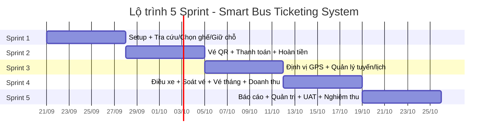

# Kế hoạch Scrum 5 Tuần
## Dự án: Smart Bus Ticketing System – ICTU

> Tài liệu này đề xuất cách chia Sprint, phân công công việc theo vai trò và kế hoạch nghiệm thu cho 24 User Story trong Product Backlog, dựa trên cơ cấu nhóm đã có (1 Product Owner, 1 Scrum Master kiêm Leader, 3 Backend, 3 Frontend, 3 Tester). Đây là khung đề xuất — nhóm nên tinh chỉnh lại số liệu (story point, người phụ trách) trong buổi **Sprint Planning** đầu mỗi Sprint cho sát thực tế.

---

## 1. Tổng quan dự án

- **Tầm nhìn:** Số hóa toàn diện việc bán vé, vận hành và theo dõi xe buýt: hành khách đặt vé/thanh toán/theo dõi lộ trình thời gian thực; nhà xe tối ưu vận hành, kiểm soát doanh thu.
- **Khung thời gian:** 5 tuần, tổ chức theo **5 Sprint x 1 tuần**.
- **Số lượng hạng mục:** 24 User Story thuộc 7 Epic.
- **Mô hình áp dụng:** Scrum (Sprint Planning → Daily Scrum → Sprint Review → Sprint Retrospective), Product Backlog do PO quản lý và sắp xếp độ ưu tiên.

---

## 2. Cơ cấu nhóm

| # | Họ và Tên | Vai trò | Trách nhiệm chính | Nguồn lực |
|---|---|---|---|---|
| 1 | Nguyễn Khánh Tùng | Product Owner | Quản lý Product Backlog, xác định thứ tự ưu tiên, đại diện khách hàng | 10 giờ/tuần |
| 2 | Quách Anh Tuấn | Scrum Master kiêm Leader | Huấn luyện Agile/Scrum, loại bỏ trở ngại, hỗ trợ ra quyết định kỹ thuật | 40 giờ/tuần |
| 3 | Nông Minh Trí, Nguyễn Quang Vinh, Phạm Đức Việt | Backend (3) | Thiết kế CSDL, xây dựng API/logic server, bảo mật & hiệu năng | 40 giờ/tuần/người |
| 4 | Trần Danh Đức, Trần Xuân Trí, Tô Văn Tiến Đạt | Frontend (3) | UI/UX, tích hợp API, responsive & tương thích trình duyệt | 40 giờ/tuần/người |
| 5 | Hà Đức Trung, Lê Đăng Tuân, Hà Văn Đức | Tester (3) | Test Plan/Test Case, kiểm thử manual/auto, quản lý bug, đảm bảo QA/QC | 40 giờ/tuần/người |

**Tổng năng lực phát triển ước tính mỗi tuần:** ~120 giờ Backend + ~120 giờ Frontend + ~120 giờ Tester + hỗ trợ kỹ thuật từ Scrum Master.

---

## 3. Product Backlog theo Epic (tóm tắt & ước lượng)

Story Point (SP) dùng thang Fibonacci rút gọn (1-2-3-5-8), là ước lượng ban đầu — nhóm nên làm lại bằng **Planning Poker** ở buổi Refinement.

| STT | Epic | User Story | SP |
|---|---|---|---|
| 1 | Đặt vé & Vé điện tử | Tra cứu tuyến xe | 5 |
| 2 | Đặt vé & Vé điện tử | Chọn vị trí ghế | 5 |
| 3 | Đặt vé & Vé điện tử | Giữ chỗ tạm thời | 3 |
| 4 | Đặt vé & Vé điện tử | Vé điện tử QR | 5 |
| 5 | Đặt vé & Vé điện tử | Hủy & Đổi vé | 5 |
| 6 | Thanh toán & Tích hợp | Cổng thanh toán (MoMo/VNPay/ZaloPay/thẻ) | 8 |
| 7 | Thanh toán & Tích hợp | Xuất hóa đơn điện tử | 3 |
| 8 | Thanh toán & Tích hợp | Hoàn tiền tự động | 5 |
| 9 | Định vị & Theo dõi | Định vị xe buýt (GPS realtime) | 8 |
| 10 | Định vị & Theo dõi | Thông báo trạm | 5 |
| 11 | Định vị & Theo dõi | Cập nhật sự cố | 3 |
| 12 | Vận hành & Chuyến xe | Quản lý tuyến & trạm | 5 |
| 13 | Vận hành & Chuyến xe | Lập lịch trình | 5 |
| 14 | Vận hành & Chuyến xe | Phân công điều xe | 5 |
| 15 | Vận hành & Chuyến xe | Soát vé QR | 5 |
| 16 | Vé tháng & Khuyến mãi | Đăng ký vé tháng | 5 |
| 17 | Vé tháng & Khuyến mãi | Duyệt đối tượng ưu đãi | 3 |
| 18 | Vé tháng & Khuyến mãi | Quản lý Voucher | 3 |
| 19 | Báo cáo & Thống kê | Doanh thu | 5 |
| 20 | Báo cáo & Thống kê | Tỷ lệ lấp đầy | 3 |
| 21 | Báo cáo & Thống kê | Xuất dữ liệu Excel/PDF | 3 |
| 22 | Quản trị & Hỗ trợ | Phân quyền tài khoản | 5 |
| 23 | Quản trị & Hỗ trợ | Nhật ký hoạt động | 3 |
| 24 | Quản trị & Hỗ trợ | Gửi phản ánh | 3 |

**Tổng: 108 SP / 24 User Story**

---

## 4. Kế hoạch 5 Sprint

### 🟦 Sprint 1 (Tuần 1) — Khởi tạo & Luồng đặt vé cơ bản — 13 SP
**Mục tiêu Sprint:** Dựng nền tảng hệ thống (kiến trúc, CSDL, UI/UX wireframe) và hoàn thành luồng lõi: tìm tuyến → chọn ghế → giữ chỗ.

| STT | User Story | SP |
|---|---|---|
| 1 | Tra cứu tuyến xe | 5 |
| 2 | Chọn vị trí ghế | 5 |
| 3 | Giữ chỗ tạm thời | 3 |

**Phân công:**
- **2 ngày đầu (toàn nhóm):** Backlog Refinement, thiết kế kiến trúc hệ thống, lược đồ CSDL, wireframe UI, thiết lập môi trường (repo, CI/CD, coding convention).
- **Backend:** API tra cứu tuyến (điểm đi/đến/thời gian), API sơ đồ ghế, cơ chế giữ chỗ (lock ghế 10 phút bằng cache/queue).
- **Frontend:** Màn hình tìm kiếm tuyến, màn hình sơ đồ ghế trực quan (chọn/hiển thị ghế trống).
- **Tester:** Viết Test Plan tổng thể dự án, Test Case cho 3 story trên, kiểm thử luồng tìm-chọn-giữ ghế.
- **PO:** Hoàn thiện & chốt thứ tự ưu tiên Backlog, duyệt tiêu chí chấp nhận (AC) từng story.
- **SM:** Thiết lập nhịp Sprint, board Scrum (Jira/Trello), hỗ trợ dựng kiến trúc.

**Increment mong đợi:** Demo được luồng "tìm tuyến → xem sơ đồ ghế → giữ chỗ tạm 10 phút".

---

### 🟩 Sprint 2 (Tuần 2) — Vé điện tử & Thanh toán — 26 SP
**Mục tiêu Sprint:** Hoàn tất vòng đời đặt vé (thanh toán → xuất vé QR → hủy/đổi/hoàn tiền).

| STT | User Story | SP |
|---|---|---|
| 4 | Vé điện tử QR | 5 |
| 5 | Hủy & Đổi vé | 5 |
| 6 | Cổng thanh toán (MoMo/VNPay/ZaloPay/thẻ) | 8 |
| 7 | Xuất hóa đơn điện tử | 3 |
| 8 | Hoàn tiền tự động | 5 |

**Phân công:**
- **Backend:** Tích hợp API cổng thanh toán (ưu tiên 1 ví trước, mở rộng sau), sinh mã QR vé, service hủy/đổi vé, quy trình hoàn tiền tự động, gửi hóa đơn qua email.
- **Frontend:** Màn hình thanh toán, hiển thị vé QR, màn hình yêu cầu hủy/đổi vé, trạng thái hoàn tiền.
- **Tester:** Test tích hợp cổng thanh toán (bao gồm case thất bại/timeout), test mã QR hợp lệ/hết hạn, test hoàn tiền tự động.
- **PO:** Làm việc với đối tác cổng thanh toán (sandbox), duyệt AC.
- **SM:** Theo dõi rủi ro tích hợp bên thứ 3, gỡ vướng kỹ thuật.

**Increment mong đợi:** Demo trọn vẹn "đặt vé → thanh toán → nhận vé QR → hủy/đổi → hoàn tiền".

---

### 🟨 Sprint 3 (Tuần 3) — Định vị thời gian thực & Quản lý tuyến — 26 SP
**Mục tiêu Sprint:** Theo dõi xe theo thời gian thực cho hành khách; công cụ quản trị tuyến/lịch trình cho nhà xe.

| STT | User Story | SP |
|---|---|---|
| 9 | Định vị xe buýt (GPS realtime) | 8 |
| 10 | Thông báo trạm | 5 |
| 11 | Cập nhật sự cố | 3 |
| 12 | Quản lý tuyến & trạm | 5 |
| 13 | Lập lịch trình | 5 |

**Phân công:**
- **Backend:** Service nhận & phát tọa độ GPS (websocket/polling), logic tính khoảng cách để bắn thông báo, CRUD tuyến/trạm/giá vé, CRUD lịch chạy.
- **Frontend:** Bản đồ realtime (tích hợp Google Maps/Mapbox), popup thông báo "xe sắp đến", trang quản trị tuyến & lịch trình (dành cho Quản lý).
- **Tester:** Test độ chính xác/độ trễ định vị, test kịch bản báo sự cố từ tài xế, test CRUD tuyến/lịch trình.
- **PO:** Xác nhận ngưỡng khoảng cách gửi thông báo, duyệt giao diện quản trị.
- **SM:** Điều phối vì đây là Sprint có nhiều phụ thuộc kỹ thuật (GPS, bản đồ) — theo sát tiến độ hằng ngày.

**Increment mong đợi:** Demo bản đồ realtime + thông báo trạm + trang quản trị tuyến/lịch trình.

---

### 🟧 Sprint 4 (Tuần 4) — Vận hành đội xe, Vé tháng & Doanh thu — 26 SP
**Mục tiêu Sprint:** Công cụ điều hành cho quản lý/tài xế; các gói vé tháng & khuyến mãi; bắt đầu phân hệ báo cáo.

| STT | User Story | SP |
|---|---|---|
| 14 | Phân công điều xe | 5 |
| 15 | Soát vé QR | 5 |
| 16 | Đăng ký vé tháng | 5 |
| 17 | Duyệt đối tượng ưu đãi | 3 |
| 18 | Quản lý Voucher | 3 |
| 19 | Doanh thu | 5 |

**Phân công:**
- **Backend:** API gán xe/tài xế cho chuyến, API quét & xác thực QR (app mobile phụ xe), logic đăng ký/gia hạn vé tháng, workflow duyệt hồ sơ ưu đãi, engine mã giảm giá, aggregation dữ liệu doanh thu.
- **Frontend:** Trang phân công điều xe (Quản lý), màn hình quét QR (tài xế/phụ xe), luồng đăng ký vé tháng (hành khách), trang duyệt hồ sơ (HR/Quản lý), trang tạo Voucher (Marketing), dashboard doanh thu (biểu đồ).
- **Tester:** Test phân công trùng lịch, test quét QR (vé hợp lệ/giả/đã dùng), test đăng ký & gia hạn vé tháng, test áp mã giảm giá, đối chiếu số liệu doanh thu.
- **PO:** Ưu tiên hoá chính sách giá vé tháng/ưu đãi, duyệt AC báo cáo doanh thu.
- **SM:** Chuẩn bị cho giai đoạn kiểm thử tổng thể sắp tới, nhắc nhóm dọn kỹ thuật nợ (technical debt).

**Increment mong đợi:** Demo điều hành chuyến, soát vé QR thực tế, đăng ký vé tháng, và dashboard doanh thu cơ bản.

---

### 🟥 Sprint 5 (Tuần 5) — Báo cáo, Quản trị hệ thống & Nghiệm thu — 17 SP + Hardening
**Mục tiêu Sprint:** Hoàn thiện phân hệ báo cáo/quản trị, kiểm thử hồi quy toàn hệ thống, chuẩn bị và thực hiện nghiệm thu cuối kỳ.

| STT | User Story | SP |
|---|---|---|
| 20 | Tỷ lệ lấp đầy | 3 |
| 21 | Xuất dữ liệu Excel/PDF | 3 |
| 22 | Phân quyền tài khoản | 5 |
| 23 | Nhật ký hoạt động | 3 |
| 24 | Gửi phản ánh | 3 |

**Phân công:**
- **Ngày 1–3:** Backend/Frontend hoàn thành 5 story còn lại (thống kê lấp đầy, xuất Excel/PDF, phân quyền Admin/Quản lý/Tài xế/Hành khách, nhật ký audit, form phản ánh).
- **Ngày 3–4:** Toàn nhóm **Regression Testing** (kiểm thử hồi quy) trên toàn bộ 24 story, sửa lỗi (bug-fix) ưu tiên theo mức độ nghiêm trọng.
- **Ngày 5:** **UAT (User Acceptance Test)** — PO cùng Tester chạy kịch bản đầu-cuối theo góc nhìn từng vai trò (hành khách/tài xế/quản lý/admin); chuẩn bị demo, slide tổng kết, biên bản nghiệm thu.
- **Cuối tuần:** **Sprint Review cuối kỳ / Lễ nghiệm thu sản phẩm** với người hướng dẫn/doanh nghiệp + **Retrospective** tổng kết cả dự án 5 tuần.

**Increment mong đợi:** Sản phẩm hoàn chỉnh (24/24 story) sẵn sàng bàn giao, có báo cáo & log audit, đã qua UAT.

---

## 5. Lịch các sự kiện Scrum (áp dụng lặp lại mỗi tuần)

| Sự kiện | Thời điểm | Thời lượng | Người chủ trì | Thành phần |
|---|---|---|---|---|
| Sprint Planning | Đầu tuần (Thứ 2) | 60–90 phút | Scrum Master | Cả nhóm |
| Daily Scrum | Mỗi ngày làm việc | 15 phút | Scrum Master | Backend, Frontend, Tester |
| Backlog Refinement | Giữa tuần (Thứ 4) | 30–45 phút | Product Owner | PO, SM, đại diện BE/FE/Tester |
| Sprint Review (Demo) | Cuối tuần (Thứ 6) | 30–45 phút | Product Owner | Cả nhóm (+ mentor tuần 5) |
| Sprint Retrospective | Ngay sau Review | 30 phút | Scrum Master | Cả nhóm |

---

## 6. Kế hoạch nghiệm thu sản phẩm

### 6.1 Definition of Done (DoD) — áp dụng cho mọi User Story
- Code hoàn thành, đã qua Code Review giữa các thành viên Backend/Frontend.
- Unit test / test case tương ứng đã chạy Pass.
- Tính năng chạy được trên môi trường staging, không còn lỗi mức độ nghiêm trọng (Critical/Blocker).
- Đáp ứng đầy đủ **Acceptance Criteria** do PO đặt ra cho story đó.
- Tài liệu API (nếu có) được cập nhật.
- PO xác nhận "Accepted" trong Sprint Review.

### 6.2 Nghiệm thu theo từng Sprint (nghiệm thu từng phần)
Cuối mỗi Sprint (Thứ 6 hằng tuần), PO cùng nhóm thực hiện:
1. Demo trực tiếp các User Story hoàn thành trong Sprint.
2. Đối chiếu với Acceptance Criteria — đánh dấu **Accepted** / **Cần chỉnh sửa**.
3. Story không đạt được đưa trở lại Backlog, ưu tiên xử lý ở Sprint kế tiếp.
4. Ghi nhận Burndown/Velocity để hiệu chỉnh kế hoạch các Sprint sau.

### 6.3 Nghiệm thu tổng thể cuối dự án (Tuần 5)
| Bước | Nội dung | Người thực hiện |
|---|---|---|
| 1 | Regression Test toàn hệ thống (24 story) | Tester (chủ trì), BE/FE hỗ trợ |
| 2 | UAT theo kịch bản vai trò (hành khách, tài xế, quản lý, admin) | PO + Tester |
| 3 | Kiểm tra phi chức năng: hiệu năng cơ bản, bảo mật đăng nhập/phân quyền, khả năng chịu tải nhẹ | Backend + Tester |
| 4 | Chuẩn bị bộ tài liệu bàn giao: Product Backlog cập nhật, sơ đồ kiến trúc, hướng dẫn triển khai/sử dụng | SM tổng hợp, cả nhóm đóng góp |
| 5 | Demo chính thức trước người hướng dẫn/doanh nghiệp | PO trình bày, cả nhóm hỗ trợ demo |
| 6 | Thu thập phản hồi, lập **Biên bản nghiệm thu** (liệt kê story Accepted / còn tồn đọng) | PO + SM |
| 7 | Retrospective tổng kết 5 tuần: bài học kinh nghiệm, đề xuất cải tiến | Cả nhóm |

**Tiêu chí nghiệm thu thành công:** ≥ 90% User Story đạt trạng thái *Accepted* theo AC, không còn lỗi mức Critical/Blocker mở, hệ thống demo được đầy đủ luồng chính từ đặt vé đến vận hành và báo cáo.

---

## 7. Rủi ro & biện pháp giảm thiểu

| Rủi ro | Mức độ | Biện pháp |
|---|---|---|
| Tích hợp cổng thanh toán (MoMo/VNPay/ZaloPay) chậm hơn dự kiến (Sprint 2) | Cao | Ưu tiên tích hợp 1 cổng trước bằng sandbox, các cổng còn lại làm sau nếu còn thời gian; có phương án thanh toán giả lập (mock) để không chặn tiến độ Frontend/Tester |
| Độ trễ/độ chính xác định vị GPS (Sprint 3) | Trung bình | Dùng dữ liệu mô phỏng (mock GPS) song song với thiết bị thật để không phụ thuộc phần cứng |
| Thành viên quá tải vì nhiều story dồn vào Sprint 2 & 4 (26 SP) | Trung bình | SM theo dõi Daily Scrum sát sao, có thể điều chuyển nhân lực linh hoạt giữa BE/FE khi cần |
| Story chưa đạt AC dồn về cuối dự án | Cao | Backlog Refinement giữa tuần để phát hiện sớm; ưu tiên "Done" thật sự hơn số lượng story mới |
| Thời gian nghiệm thu (Tuần 5) gấp nếu phát sinh lỗi lớn | Cao | Dành hẳn 2 ngày cuối Sprint 4 để rà soát sớm, không dồn hết việc kiểm thử vào Tuần 5 |

---

## 8. Timeline tổng quan

---

### Ghi chú
- Story Point trong tài liệu là **ước lượng sơ bộ** để cân bằng khối lượng công việc giữa các Sprint; nhóm nên chạy **Planning Poker** thực tế ở Sprint Planning để chốt số liệu chính xác hơn.
- Việc phân công theo "Backend/Frontend/Tester" ở mức nhóm; trong mỗi Sprint Planning, 3 thành viên mỗi nhóm nên tự chia nhỏ ai phụ trách module nào để tránh chồng chéo.
- Nếu tiến độ Sprint 2–4 bị chậm, ưu tiên giữ nguyên các Epic "lõi" (Đặt vé, Thanh toán, Vận hành) và có thể cắt giảm phạm vi ở Epic "Báo cáo & Thống kê" hoặc "Khuyến mãi" vì đây là các tính năng bổ trợ, ít ảnh hưởng luồng chính.
