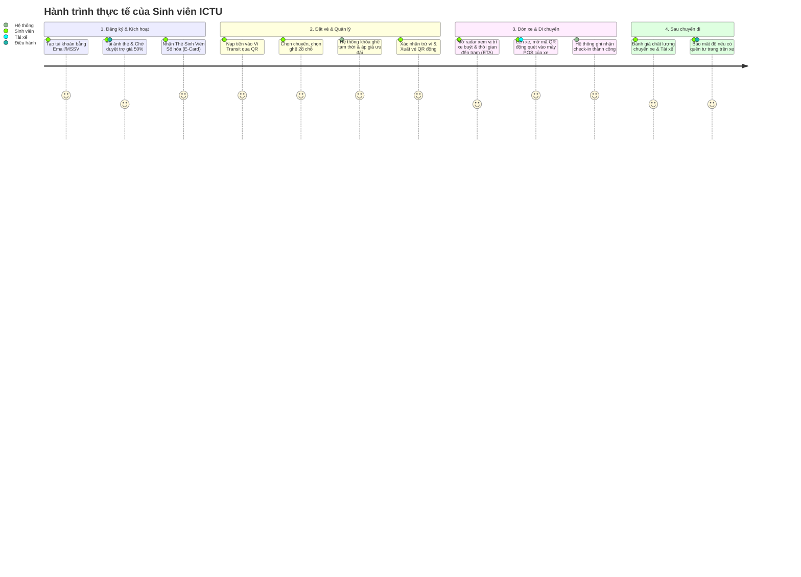

# KẾ HOẠCH TỔNG THỂ THIẾT KẾ PHÂN HỆ SINH VIÊN (STUDENT PORTAL MASTER PLAN)
## Giải quyết triệt để vấn đề "Vỏ đẹp ruột rỗng" & Tái thiết kế toàn diện Frontend - Backend

---

## 1. BỐI CẢNH & ĐÁNH GIÁ HIỆN TRẠNG HỆ THỐNG

### 1.1. Hiện tượng ghi nhận từ người dùng
- Khi người dùng đăng nhập bằng tài khoản Sinh viên (`sv.ictu@ictu.edu.vn` hoặc tài khoản đăng ký mới với vai trò Sinh viên ICTU):
  - Sidebar hiển thị đúng tên vai trò: `Nguyễn Văn B (DTC245180025 - HSSV)` và danh mục menu `Vé của tôi`, `Mua vé xe 28 chỗ`, `Mạng lưới tuyến xe`, `Thẻ NFC Sinh Viên`.
  - **Tuy nhiên, vùng nội dung trung tâm lại render nguyên vẹn Dashboard Quản trị/Điều hành:** Hiển thị *Doanh thu hôm nay (48,6 trđ)*, *Số chuyến hoàn thành*, *Tỷ lệ lấp đầy ghế*, *Biểu đồ phân tài xế* và *Cảnh báo hỏng hóc kỹ thuật (áp suất lốp, hỏng xe)*.
- **Đánh giá cốt lõi từ người dùng:** *"Hệ thống hiện tại vỏ đẹp nhưng ruột rỗng"* – Các chức năng dành cho hành khách/sinh viên chủ yếu là popup mô phỏng tĩnh, chưa có luồng nghiệp vụ thực chất, chưa kết nối cơ sở dữ liệu thật, chưa có vòng đời của một chiếc vé xe buýt từ lúc đặt chỗ đến lúc quét mã lên xe.

### 1.2. Nguyên nhân kỹ thuật gốc rễ (Root Cause)
1. **Frontend View Router sơ sài:** Trong [`app-shell.tsx`](file:///c:/Users/HP%20VICTUS/Downloads/QLy_V-_Xe_Bu-t_Th-ng_Minh-main/frontend/components/portal/app-shell.tsx#L101-L105), nhánh xử lý `role === 'student'` đang fallback trả về component `<OpsDashboard />`. Component này vốn được viết riêng cho Admin & Dispatcher xem KPI doanh thu và cảnh báo kỹ thuật của đội xe.
2. **Thiếu vắng hoàn toàn các View Component dành riêng cho Sinh viên:** Hệ thống chưa xây dựng các màn hình:
   - `StudentDashboardView`: Trang chủ cá nhân của sinh viên (Thẻ sinh viên số, Vé xe sắp chạy, Nạp tiền, Đón xe).
   - `MyTicketsView`: Quản lý vé lượt, vé tháng, xuất mã QR động chống gian lận.
   - `BookingFlowView`: Quy trình 4 bước đặt chỗ 28 ghế thực chất (Khóa ghế tạm thời, tính giá giảm 50%, trừ ví).
   - `StudentPassRegistrationView`: Đăng ký, gia hạn vé tháng trợ giá.
   - `TransitWalletView`: Ví điện tử nội bộ, nạp tiền VietQR/MoMo, lịch sử dòng tiền.
   - `LiveBusRadarView`: Bản đồ đón xe buýt theo góc nhìn của hành khách (Xem trạm gần nhất, xem ETA xe đến đón).
3. **Backend NestJS chưa mở các Controller chuyên biệt cho Sinh viên:** Mặc dù Backend đã có Database Schema tương đối bài bản (`schema.sql`), nhưng chưa có module API khép kín phục vụ trực tiếp cho tác nhân Sinh viên (`/api/v1/student/...`).

---

## 2. CHÂN DUNG & HÀNH TRÌNH TÁC NHÂN SINH VIÊN (STUDENT PERSONA)

### 2.1. Đặc thù tác nhân Sinh viên ICTU
- **Tần suất di chuyển:** Rất cao (1-4 chuyến/ngày vào giờ cao điểm: sáng 06:45 - 07:30, trưa 11:30 - 12:30, chiều 16:30 - 18:00).
- **Mối quan tâm hàng đầu:**
  1. **Chính sách trợ giá:** Được giảm 50% giá vé xe buýt theo quy định HSSV (chỉ từ 5.000đ/lượt hoặc vé tháng ưu đãi).
  2. **Thời gian chính xác:** Không được muộn giờ điểm danh học tập; cần biết xe buýt đang ở đâu và còn bao nhiêu phút nữa thì tới trạm đón.
  3. **Tiện lợi, không dùng tiền mặt:** Sử dụng điện thoại quét mã QR hoặc thẻ ảo NFC một chạm; nạp tiền qua QR ngân hàng hoặc ví điện tử.
  4. **Giữ chỗ trước:** Trong các khung giờ cao điểm hoặc tuyến đường dài (Thành phố Thái Nguyên $\leftrightarrow$ ICTU), muốn đặt trước số ghế cụ thể trên xe 28 chỗ để đảm bảo có chỗ ngồi học tập/nghỉ ngơi.



---

## 3. PHÂN RÃ 7 NGHIỆP VỤ CHÍNH CỦA SINH VIÊN (CORE BUSINESS DOMAINS)

Dưới đây là 7 nghiệp vụ bắt buộc phải có để hệ thống đạt chuẩn "ruột đặc, nghiệp vụ thật, trải nghiệm xuất sắc":

### Nghiệp vụ 1: Định danh Sinh viên số, Thẻ HSSV Điện tử & Trợ giá 50%
- **Mục tiêu:** Xác định danh tính sinh viên ICTU để áp dụng chính sách trợ giá theo quy định nhà trường và Sở GTVT.
- **Quy trình chi tiết:**
  1. Sinh viên vào mục "Hồ sơ & Thẻ sinh viên", điền thông tin: Mã sinh viên (MSSV), Lớp, Khoa/Viện, Niên khóa, Số CCCD.
  2. Tải lên 2 ảnh: Ảnh chân dung 3x4 (làm ảnh thẻ) và Ảnh thẻ sinh viên / Giấy xác nhận sinh viên.
  3. Trạng thái hồ sơ:
     - `DRAFT`: Chưa gửi xác thực.
     - `PENDING`: Đang chờ Điều hành viên / Ban quản trị duyệt (có thông báo rõ ràng).
     - `VERIFIED`: Đã duyệt – Kích hoạt phù hiệu **"Sinh viên ICTU - Trợ giá 50%"** vĩnh viễn trong niên khóa.
     - `REJECTED`: Bị từ chối (hiển thị rõ lý do: ảnh mờ, sai MSSV... kèm nút cho phép nộp lại).
  4. **Thẻ sinh viên số hóa (Digital Student Pass):**
     - Mô phỏng chiếc thẻ sinh viên thông minh với hiệu ứng dập nổi hologram, chip NFC ảo, mã vạch Code128, mã QR định danh và dấu mộc điện tử ICTU Transit.
     - Có thể dùng thẻ này để quẹt thẻ tháng trực tiếp trên xe.

---

### Nghiệp vụ 2: Mua vé lượt & Đặt trước chỗ ngồi trên xe 28 chỗ
- **Mục tiêu:** Giúp sinh viên chủ động chọn chỗ ngồi, không lo hết chỗ vào giờ cao điểm, áp dụng ngay giá trợ giá 50%.
- **Quy trình chi tiết (Quy trình 4 bước chuẩn E-Commerce):**
  - **Bước 1: Tra cứu chuyến:** Chọn Điểm đi $\rightarrow$ Điểm đến (Tuyến CT-01, CT-02, CP-03...), Chọn Ngày đi và Khung giờ mong muốn. Hệ thống liệt kê các chuyến xe (`Trips`) còn chỗ, thời gian xuất bến, biển số xe và loại xe (28 chỗ điện cao cấp).
  - **Bước 2: Chọn ghế trực quan (28 chỗ chuẩn 7x4):**
    - Hiển thị trực quan layout 7 hàng ghế (dãy A, B bên trái; lối đi; dãy C, D bên phải).
    - Phân biệt 4 trạng thái ghế: `Trống (xanh/trắng)`, `Đã có khách mua (đỏ khóa)`, `Đang có người giữ chỗ (vàng nhấp nháy)`, `Đang được bạn chọn (xanh ngọc sáng)`.
    - **Cơ chế Khóa ghế tạm thời (Seat Lock Timeout):** Khi sinh viên bấm chọn ghế, hệ thống tạm khóa ghế đó trong **10 phút** để người khác không thể tranh chấp. Có đồng hồ đếm ngược `09:59...`.
  - **Bước 3: Xác nhận & Tính giá ưu đãi:**
    - Giá gốc vé lượt: ví dụ `10.000đ`.
    - Hệ thống kiểm tra trạng thái tài khoản: Nếu là Sinh viên ICTU đã duyệt $\rightarrow$ Tự động chiết khấu 50% còn `5.000đ/vé`.
    - Ô nhập mã giảm giá bổ sung (Voucher) nếu có.
  - **Bước 4: Thanh toán & Xuất vé:**
    - Phương thức 1: Trừ trực tiếp vào Số dư Ví Transit (Thanh toán 1-click tức thì).
    - Phương thức 2: Quét mã VietQR động / MoMo.
    - Phương thức 3: Đặt trước - Thanh toán tiền mặt khi lên xe.
    - Hoàn tất: Hệ thống sinh `Booking Code` và `Ticket Code`, lưu vào mục "Vé của tôi".

---

### Nghiệp vụ 3: Đăng ký, Gia hạn & Quản lý Vé tháng (Monthly Pass)
- **Mục tiêu:** Cung cấp giải pháp đi lại trọn gói, tiết kiệm tối đa cho sinh viên đi học hàng ngày.
- **Quy trình chi tiết:**
  1. **Lựa chọn gói vé tháng:**
     - *Gói 1 Tuyến Cố Định (ví dụ Tuyến 01 hoặc Tuyến Campus):* Giá gốc 140.000đ/tháng $\rightarrow$ Trợ giá HSSV còn **70.000đ/tháng** (Không giới hạn số lượt đi).
     - *Gói Liên Tuyến Toàn Mạng Lưới:* Giá gốc 240.000đ/tháng $\rightarrow$ Trợ giá HSSV còn **120.000đ/tháng**.
     - *Gói Học Kỳ (5 tháng):* Tặng thêm 10% ưu đãi.
  2. **Thời hạn hiệu lực:** Chọn kích hoạt từ ngày mùng 1 tháng tới hoặc kích hoạt ngay 30 ngày kể từ ngày thanh toán.
  3. **Thanh toán & Kích hoạt:** Trừ ví hoặc thanh toán QR $\rightarrow$ Kích hoạt thẻ tháng vào hồ sơ sinh viên.
  4. **Tính năng gia hạn thông minh (Auto-Renewal Alert):** Trước khi vé tháng hết hạn 5 ngày, hệ thống hiển thị thông báo nhắc nhở kèm nút **"Gia hạn nhanh 1 chạm"**.

---

### Nghiệp vụ 4: Vé của tôi & Trải nghiệm Quẹt mã lên xe (Smart Check-in & Dynamic QR)
- **Mục tiêu:** Giải quyết triệt để vấn đề gian lận (chụp màn hình vé gửi cho người khác đi nhờ), hỗ trợ phụ xe/soát vé nhận diện vé hợp lệ trong 1 giây.
- **Tính năng chi tiết:**
  1. **Tab phân loại trực quan:**
     - `Vé sắp khởi hành` (Hiển thị thẻ vé nổi bật nhất với thời gian đếm ngược đến giờ xe chạy).
     - `Vé tháng đang hiệu lực` (Hiển thị thời hạn còn lại, số chuyến đã đi trong tháng).
     - `Lịch sử vé đã hoàn thành`.
     - `Vé đã hủy / Hoàn tiền`.
  2. **Chế độ Trình vé (Boarding Pass View):**
     - **Dynamic QR Code (Mã QR động):** Mã QR được mã hóa bằng thuật toán HMAC + Timestamp, **tự động xoay mã sau mỗi 30 giây**. Nếu hành khách chụp ảnh màn hình gửi cho người khác, ảnh chụp sẽ hết hạn sau 30 giây.
     - **Hiệu ứng chống gian lận (Anti-fraud Watermark):** Dải sóng radar quét chuyển động liên tục + đồng hồ đếm giây thực tế trên màn hình, giúp phụ xe liếc qua là biết ngay đang mở app trực tiếp chứ không phải xem ảnh tĩnh.
  3. **Thao tác quản lý vé:**
     - Xem chi tiết lộ trình và các trạm dừng của chuyến.
     - Nút "Hủy vé & Hoàn tiền vào ví": Hủy trước giờ xe chạy 30 phút được hoàn 100% tiền vào ví Transit; hủy trước 15 phút hoàn 70%; hủy sát giờ không hoàn.

---

### Nghiệp vụ 5: Ví điện tử Transit & Quản lý Tài chính cá nhân
- **Mục tiêu:** Sinh viên có thể chủ động nạp tiền một lần (50k, 100k, 200k) để thanh toán vé lượt hoặc vé tháng bất kỳ lúc nào mà không cần mở app ngân hàng nhiều lần.
- **Tính năng chi tiết:**
  1. **Thẻ số dư ví:** Hiển thị số dư khả dụng (VNĐ), tổng tiền đã tiết kiệm được nhờ trợ giá sinh viên.
  2. **Nạp tiền vào ví (Top-up):**
     - Chọn mệnh giá nhanh: 50.000đ, 100.000đ, 200.000đ, 500.000đ hoặc nhập số tiền tùy ý.
     - Sinh mã VietQR động chuẩn NAPAS 247 (kèm nội dung chuyển khoản tự động gán ID ví, ví dụ: `ICTU NAP 0987654321`).
     - Tích hợp cổng thanh toán giả lập / webhook xác nhận tiền vào ví trong 3 giây.
  3. **Lịch sử biến động số dư (Transaction Ledger):**
     - Thống kê chi tiết từng dòng tiền: `Nạp tiền (+)` màu xanh lá, `Thanh toán vé (-)` màu đỏ, `Hoàn tiền vé hủy (+)` màu xanh lam.
     - Xem và tải biên lai điện tử của từng giao dịch.

---

### Nghiệp vụ 6: Bản đồ Đón xe Buýt & Dự báo Giờ xe đến Trạm (Live Bus Radar & ETA)
- **Mục tiêu:** Sinh viên không cần đứng chờ ngoài trời nắng mưa; mở app lên là biết xe buýt số mấy đang chạy, còn cách trạm bao xa và mấy phút nữa tới.
- **Tính năng chi tiết:**
  1. **Bản đồ trực quan dành riêng cho sinh viên:**
     - Không hiển thị các thông số kỹ thuật phức tạp của Admin; bản đồ tập trung hiển thị: Vị trí của sinh viên $\rightarrow$ Các trạm xe buýt xung quanh khuôn viên ICTU $\rightarrow$ Các xe buýt đang di chuyển trên tuyến.
  2. **Bảng dự báo thời gian thực (Live ETA Board):**
     - Hiển thị danh sách các xe buýt đang tiến về trạm gần nhất:
       - *Ví dụ:* Tuyến CT-01 (Xe điện 20B-012.45) $\rightarrow$ Cách trạm KTX ICTU **2 trạm dừng (khoảng 4 phút)**.
       - Tình trạng xe: `Đang chạy (32 km/h)`, `Đang dừng trả khách`, `Đông khách / Còn nhiều chỗ`.
  3. **Đặt nhắc nhở đón xe (Smart Bus Alarm):**
     - Sinh viên bấm "Nhắc tôi khi xe cách trạm 500m" $\rightarrow$ Hệ thống phát thông báo chuông nhắc sinh viên chuẩn bị ra điểm đón.

---

### Nghiệp vụ 7: Lịch sử Di chuyển, Đánh giá Chuyến xe & Báo Thất Lạc Đồ
- **Mục tiêu:** Nâng cao chất lượng dịch vụ xe buýt thông minh, giải quyết nhanh các vấn đề phát sinh của sinh viên.
- **Tính năng chi tiết:**
  1. **Nhật ký hành trình:** Lưu trữ từng chuyến xe đã đi (thời gian quét mã, tài xế phục vụ, biển số xe, tuyến đường).
  2. **Đánh giá chuyến đi (Rating & Feedback):**
     - Chấm điểm 1 đến 5 sao cho tài xế và chuyến xe.
     - Đánh giá theo tiêu chí: *Lái xe an toàn*, *Xe sạch sẽ thoáng mát*, *Đúng giờ*, *Thái độ văn minh*.
  3. **Cổng tiếp nhận Báo mất đồ trên xe (Lost & Found):**
     - Sinh viên làm rơi thẻ, ví, laptop, chìa khóa trên xe có thể tạo phiếu báo mất đồ ngay trên app.
     - Chọn chuyến xe vừa đi (hệ thống tự điền biển số xe và tài xế phụ trách), nhập mô tả đồ vật, đính kèm ảnh và số điện thoại liên hệ.
     - Phiếu được đẩy thẳng sang màn hình của Điều hành viên và Tài xế để liên hệ trả lại đồ cho sinh viên.

---

## 4. BẢNG MA TRẬN SO SÁNH GIỮA DASHBOARD ADMIN VÀ DASHBOARD SINH VIÊN

Để bạn thấy rõ sự khác biệt triệt để giữa "Dashboard Điều hành của Admin" và "Trang tiện ích thực chất của Sinh viên", bảng đối soát dưới đây làm rõ sự thay đổi:

| Thành phần hiển thị | Dashboard Admin / Điều hành (Cũ - Bị hiển thị nhầm) | Dashboard Sinh viên ICTU (Mới - Thiết kế chuẩn) |
| :--- | :--- | :--- |
| **KPI Cards trên cùng** | Doanh thu ngày (48,6 trđ), Số chuyến hoàn thành (186/240), Tỷ lệ lấp đầy ghế (84%), Tốc độ trung bình (28 km/h). | **Thẻ Sinh Viên Số (E-Card)**: Họ tên, MSSV, Khoa, Badge Trợ giá 50%, **Số dư Ví Transit (đ)** kèm nút Nạp tiền nhanh. |
| **Khu vực trung tâm** | Bảng danh sách phân tài xế, điều phối xe buýt xuất bến theo ca làm việc. | **Thẻ "Vé sắp khởi hành gần nhất"**: Biển số xe, giờ đón, trạm đón, đồng hồ đếm ngược giờ chạy + Nút lớn **"Mở vé lên xe (Dynamic QR)"**. |
| **Khu vực phụ bên phải** | Danh sách cảnh báo kỹ thuật hỏng xe: Tắc đường, Áp suất lốp xe 20B-018, Máy quét QR mất kết nối. | **Radar xe buýt gần bạn**: Tuyến xe buýt sắp ghé trạm KTX ICTU (ETA 4 phút), tình trạng còn chỗ. |
| **Lối tắt thao tác nhanh** | Phân quyền nhân sự, Sửa tuyến, Xem log viễn thông. | **4 nút tiện ích 1 chạm**: `Đặt vé 28 chỗ`, `Đăng ký vé tháng`, `Ví & Lịch sử`, `Báo quên đồ`. |
| **Menu điều hướng Sidebar** | Bàn làm việc, Tuyến đường, Đội xe, Nhân sự, Báo cáo, Cài đặt. | `Trang chủ tiện ích`, `Vé của tôi`, `Đặt chỗ 28 ghế`, `Vé tháng HSSV`, `Radar xe buýt`, `Ví cá nhân`, `Lịch sử & Phản ánh`. |

---

## 5. THIẾT KẾ KIẾN TRÚC FRONTEND (UI/UX) CHO PHÂN HỆ SINH VIÊN

Hệ thống Frontend sẽ được cấu trúc lại như sau:

```
frontend/components/portal/student/
├── student-dashboard.tsx          # Trang tổng quan chính của sinh viên (E-Card, Vé sắp chạy, Ví, Radar)
├── my-tickets/
│   ├── my-tickets-view.tsx        # Danh sách vé (Sắp đi, Vé tháng, Lịch sử)
│   ├── dynamic-qr-modal.tsx       # Modal trình vé QR xoay vòng 30s + Anti-fraud watermark
│   └── ticket-detail-modal.tsx    # Xem chi tiết lộ trình, điểm đón, ghế ngồi
├── booking/
│   ├── seat-booking-flow.tsx      # Luồng 4 bước đặt vé xe 28 chỗ thực chất
│   ├── seat-map-28.tsx            # Sơ đồ 28 ghế tương tác realtime (7 hàng x 4 ghế, khóa tạm thời)
│   └── booking-summary.tsx        # Tóm tắt thanh toán, áp trợ giá 50%, voucher
├── monthly-pass/
│   ├── monthly-pass-view.tsx      # Quản lý vé tháng, thời hạn, lượt sử dụng
│   ├── register-pass-modal.tsx    # Modal đăng ký vé tháng kèm nộp minh chứng HSSV
│   └── pass-renewal-modal.tsx     # Gia hạn vé tháng 1 chạm
├── live-radar/
│   ├── student-radar-view.tsx     # Bản đồ đón xe buýt, định vị trạm dừng, tính ETA
│   └── station-eta-card.tsx       # Thẻ thông tin xe sắp tới trạm
├── wallet/
│   ├── wallet-view.tsx            # Quản lý số dư, biến động dòng tiền
│   ├── topup-modal.tsx            # Nạp tiền tự động qua mã VietQR
│   └── transaction-history.tsx    # Lịch sử nạp/chi/hoàn tiền
└── support/
    ├── trip-history-view.tsx      # Lịch sử các chuyến xe đã đi
    ├── rating-modal.tsx           # Đánh giá tài xế và dịch vụ
    └── lost-found-modal.tsx       # Báo mất đồ trên xe
```

---

## 6. THIẾT KẾ KIẾN TRÚC BACKEND & CƠ SỞ DỮ LIỆU (NESTJS + POSTGRESQL)

### 6.1. Bổ sung các bảng cơ sở dữ liệu còn thiếu để "ruột đặc"
Hiện tại file [`schema.sql`](file:///c:/Users/HP%20VICTUS/Downloads/QLy_V-_Xe_Bu-t_Th-ng_Minh-main/backend/src/database/schema.sql) đã có các bảng: `users`, `routes`, `trips`, `bookings`, `tickets`, `monthly_passes`, `feedback`. Ta bổ sung thêm các bảng sau để hỗ trợ đầy đủ nghiệp vụ ví tiền và khóa ghế:

```sql
-- 1. Bảng Ví tiền điện tử cá nhân của Sinh viên
CREATE TABLE IF NOT EXISTS wallets (
    id UUID PRIMARY KEY DEFAULT uuid_generate_v4(),
    user_id UUID NOT NULL UNIQUE REFERENCES users(id) ON DELETE CASCADE,
    balance DECIMAL(12,0) NOT NULL DEFAULT 0 CHECK (balance >= 0),
    currency VARCHAR(10) DEFAULT 'VND',
    status VARCHAR(20) DEFAULT 'active',
    created_at TIMESTAMPTZ DEFAULT NOW(),
    updated_at TIMESTAMPTZ DEFAULT NOW()
);

-- 2. Bảng Lịch sử giao dịch ví (Transaction Ledger)
CREATE TABLE IF NOT EXISTS wallet_transactions (
    id UUID PRIMARY KEY DEFAULT uuid_generate_v4(),
    wallet_id UUID NOT NULL REFERENCES wallets(id) ON DELETE CASCADE,
    type VARCHAR(30) NOT NULL, -- 'topup', 'booking_payment', 'monthly_pass_payment', 'refund'
    amount DECIMAL(12,0) NOT NULL,
    balance_before DECIMAL(12,0) NOT NULL,
    balance_after DECIMAL(12,0) NOT NULL,
    reference_id VARCHAR(100), -- mã booking_code hoặc transaction_id ngân hàng
    description VARCHAR(255) NOT NULL,
    created_at TIMESTAMPTZ DEFAULT NOW()
);

-- 3. Bảng Khóa ghế tạm thời (Tránh 2 người cùng chọn 1 ghế khi đang thanh toán)
CREATE TABLE IF NOT EXISTS seat_locks (
    id UUID PRIMARY KEY DEFAULT uuid_generate_v4(),
    trip_id UUID NOT NULL REFERENCES trips(id) ON DELETE CASCADE,
    seat_id UUID NOT NULL REFERENCES seats(id) ON DELETE CASCADE,
    user_id UUID NOT NULL REFERENCES users(id) ON DELETE CASCADE,
    locked_at TIMESTAMPTZ DEFAULT NOW(),
    expires_at TIMESTAMPTZ NOT NULL, -- Thời điểm hết hạn khóa (thường +10 phút)
    UNIQUE(trip_id, seat_id)
);

-- 4. Bảng Báo mất đồ trên xe buýt (Lost & Found)
CREATE TABLE IF NOT EXISTS lost_found_reports (
    id UUID PRIMARY KEY DEFAULT uuid_generate_v4(),
    user_id UUID NOT NULL REFERENCES users(id) ON DELETE CASCADE,
    trip_id UUID REFERENCES trips(id),
    item_name VARCHAR(150) NOT NULL,
    category VARCHAR(50), -- 'wallet', 'electronics', 'documents', 'keys', 'other'
    description TEXT NOT NULL,
    image_url VARCHAR(500),
    contact_phone VARCHAR(20) NOT NULL,
    status VARCHAR(30) DEFAULT 'pending', -- 'pending', 'investigating', 'found', 'returned', 'closed'
    found_notes TEXT,
    resolved_by UUID REFERENCES users(id),
    resolved_at TIMESTAMPTZ,
    created_at TIMESTAMPTZ DEFAULT NOW()
);
```

### 6.2. Thiết kế hệ thống RESTful API Endpoints cho Phân hệ Sinh viên
Tạo riêng module `StudentModule` trong NestJS (`backend/src/modules/student/`) với các API sau:

| Phương thức | Đường dẫn API | Chức năng nghiệp vụ |
| :--- | :--- | :--- |
| `GET` | `/api/v1/student/profile` | Lấy thông tin hồ sơ HSSV, trạng thái duyệt trợ giá, số dư ví. |
| `POST` | `/api/v1/student/profile/verify` | Nộp hồ sơ và ảnh thẻ 3x4 để xin duyệt trợ giá 50%. |
| `GET` | `/api/v1/student/dashboard/summary` | Lấy dữ liệu tổng quan cho trang chủ sinh viên (Vé sắp chạy, thông báo, trạm gần). |
| `GET` | `/api/v1/student/trips/search` | Tìm kiếm chuyến xe theo tuyến, ngày, giờ, kiểm tra số ghế 28 chỗ còn trống. |
| `POST` | `/api/v1/student/bookings/lock-seat` | Khóa tạm thời 1 hoặc nhiều ghế trong 10 phút. |
| `POST` | `/api/v1/student/bookings/checkout` | Xác nhận đặt vé, tự động trừ tiền ví hoặc chọn thanh toán QR. |
| `GET` | `/api/v1/student/tickets/my-tickets` | Lấy danh sách tất cả vé của sinh viên (sắp đi, đã đi, đã hủy). |
| `GET` | `/api/v1/student/tickets/:id/dynamic-qr` | Lấy chuỗi mã QR động được sinh bằng HMAC bảo mật, xoay vòng mỗi 30s. |
| `POST` | `/api/v1/student/tickets/:id/cancel` | Hủy vé trước giờ xe chạy và nhận hoàn tiền vào ví theo chính sách. |
| `GET` | `/api/v1/student/monthly-passes/plans` | Lấy danh sách bảng giá các gói vé tháng HSSV (1 tuyến, liên tuyến). |
| `POST` | `/api/v1/student/monthly-passes/register` | Đăng ký mua vé tháng mới. |
| `POST` | `/api/v1/student/monthly-passes/:id/renew` | Gia hạn vé tháng hiện có thêm 30 ngày. |
| `GET` | `/api/v1/student/wallet/balance` | Lấy số dư ví và lịch sử nạp/chi tiêu. |
| `POST` | `/api/v1/student/wallet/create-topup` | Tạo yêu cầu nạp tiền, sinh mã VietQR động để chuyển khoản. |
| `GET` | `/api/v1/student/radar/nearby` | Lấy vị trí các xe buýt đang chạy và thời gian ước tính (ETA) tới trạm sinh viên đón. |
| `POST` | `/api/v1/student/trips/:id/feedback` | Gửi đánh giá sao và nhận xét về chuyến đi/tài xế. |
| `POST` | `/api/v1/student/support/lost-found` | Tạo phiếu báo mất đồ trên xe. |

---

## 7. LỘ TRÌNH TRIỂN KHAI ĐỀ XUẤT (IMPLEMENTATION ROADMAP)

Để đảm bảo từng chức năng khi làm xong đều có "ruột đặc", hoạt động trơn tru từ giao diện đến lưu trữ dữ liệu, lộ trình được chia thành 4 giai đoạn cụ thể:

### Giai đoạn 1: Tách biệt View & Xây dựng Student Dashboard hoàn toàn mới
- Sửa ngay lỗi điều hướng: Khi tài khoản có role `student` đăng nhập, thay vì render `<OpsDashboard />`, hệ thống sẽ render component `<StudentDashboard />`.
- Xây dựng giao diện trang chủ sinh viên: Thẻ Sinh viên số (E-Card), Số dư ví, Thẻ vé sắp chạy kèm đếm ngược, Lối tắt 4 chức năng chính.
- Bổ sung cấu trúc lưu trữ dữ liệu sinh viên trong persistent storage / API.

### Giai đoạn 2: Nghiệp vụ Đặt chỗ 28 ghế & Vòng đời Vé điện tử Dynamic QR
- Hoàn thiện luồng đặt chỗ xe 28 chỗ trực quan (7 hàng x 4 ghế): có khóa ghế tạm thời 10 phút, tính tự động giá giảm 50% cho sinh viên.
- Hoàn thiện trang "Vé của tôi" với màn hình Trình vé có Dynamic QR Code xoay vòng 30 giây + Anti-fraud scanning bar.
- Tính năng Hủy vé và tự động hoàn tiền vào ví.

### Giai đoạn 3: Nghiệp vụ Vé tháng & Ví điện tử Transit
- Xây dựng màn hình Quản lý Vé tháng HSSV: Xem hạn sử dụng, đăng ký gói mới, gia hạn 1 chạm.
- Xây dựng Ví tiền điện tử nội bộ: Quản lý số dư, tạo mã VietQR động để nạp tiền thật/mock, hiển thị lịch sử biến động số dư.

### Giai đoạn 4: Radar đón xe buýt (Live ETA), Đánh giá & Báo mất đồ
- Xây dựng bản đồ đón xe dành riêng cho sinh viên: Xem trạm đón gần nhất, xem ETA xe buýt đến trạm.
- Hoàn thiện chức năng Đánh giá chuyến xe và Cổng báo thất lạc đồ (Lost & Found).
- Kết nối đồng bộ với Backend NestJS và Database PostgreSQL.

---

## 8. CÂU HỎI THAM VẤN & XIN Ý KIẾN BẠN
1. **Về cấu trúc menu của Sinh viên:** Bạn có muốn giữ nguyên 4 mục hiện tại (`Vé của tôi`, `Mua vé xe 28 chỗ`, `Mạng lưới tuyến xe`, `Thẻ NFC Sinh Viên`) hay mở rộng thành 6 mục chi tiết như đề xuất (`Trang chủ tiện ích`, `Vé của tôi`, `Đặt vé 28 chỗ`, `Vé tháng HSSV`, `Radar đón xe`, `Ví & Lịch sử`)?
2. **Về cơ chế thanh toán:** Trong giai đoạn thử nghiệm này, bạn muốn sử dụng **Ví tiền điện tử Transit** (có sẵn tiền mẫu để sinh viên trừ tiền trực tiếp) kết hợp quét VietQR giả lập nạp tiền, hay muốn tích hợp hình thức nào khác?
3. **Thứ tự ưu tiên triển khai:** Bạn muốn ưu tiên làm ngay **Giai đoạn 1 + 2** (Trang chủ sinh viên riêng biệt + Luồng đặt vé 28 ghế thực tế & Vé QR) trước, hay bạn có đề xuất điều chỉnh phần nào trong bản plan này?
